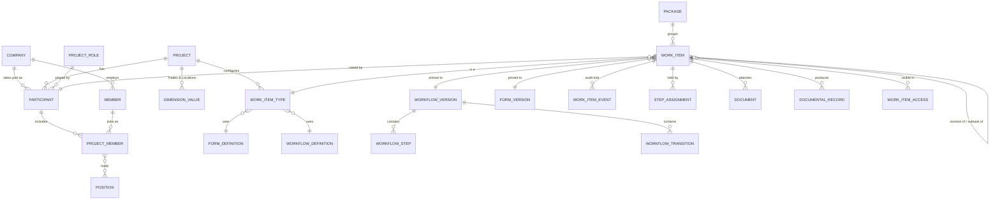

# Rabaed data model (Project Module, v1 draft)

The logical data model for the platform and the Project Module, in PostgreSQL terms. Names follow [GLOSSARY.md](../GLOSSARY.md). Schedule, Tendering and Financial are out of scope. Each Instance (standard / KSA) runs this same schema independently.

## Conventions

- **IDs** are random UUIDv4 in every table: safe to expose, because they carry no time, and nothing to enumerate. Not UUIDv7, whose creation time would reveal when a Draft was started ([ADR 0015](adr/0015-random-ids-not-uuidv7.md)).
  Being random, an id never orders rows; it only breaks ties. Un-numbered Drafts (and items not yet Submitted) order by Subject, then id; Links by `created_at`, the linked item's Document Number, then id; Documents in upload order (`app.document_times`' `seq`: `confirmed_at`, file name, then id).
- **Bilingual content** entered by customers (names, labels) is stored as `i18n jsonb` (`{"en": "...", "ar": "..."}`), so further languages can be added without schema changes. UI strings are *not* in the database; they are translation keys (Lokalise).
- **Library pattern.** Forms, Workflows, Work Item Types, Positions, Trades and Scopes exist at three levels: `owner_kind ∈ {rabaed, company, project}` + `owner_id`. Using one always **copies** it down a level (`copied_from_id` keeps provenance). Nothing is linked live.
- **Nothing is hard-deleted.** Rows are deactivated, withdrawn, cancelled or closed.
- **Every table carries** `created_at`, `created_by`, `updated_at`. Change history for regulated tables goes to the audit log (§9).
- `→` means foreign key.

## Core relationships

---

## 1. Platform and tenancy

Tenancy is per Project (ADR 0007): every Project-owned table has `project_id` and a row-level-security policy that allows rows only for Projects the current Member participates in. Company-owned tables have `company_id` and a policy limited to the Member's own Company.

**company**
`id`, `legal_name i18n`, `cr_number` (unique), `vat_number` (unique), `status {active, suspended}`, `authorized_person_id → member` (exactly one; nullable only while onboarding), `onboarded_by → rabaed_engineer`.

**member**
`id`, `company_id → company`, `email` (unique per Instance), `full_name i18n`, `phone`, `locale`, `status {invited, active, locked, deactivated}`, `can_create_projects bool` (= Project Creator).
A Member never moves between Companies. Changing employer means a new Member.

**credential**
`member_id` or `engineer_id` (exactly one), `password_hash` (argon2id, PHC string). Authentication is in-house (email + password); Members' MFA factors and lockout counters get their own table and columns later (Rabaed Engineers have them, below). The app role never reads it directly.

**session**
`token_hash` (SHA-256 of the random cookie token), `member_id`, `expires_at`, `revoked_at`. Server-side: signing out revokes the row. Members only: the customer api neither creates nor resolves a session for an Engineer (its `engineer_id` column is left from before ADR 0010).

**invitation**
`member_id`, `token_hash`, `invited_by_engineer_id` or `invited_by_member_id`, `expires_at`, `used_at`. One-time and expiring; accepting it sets the password and activates the Member.

Identity tables record who created a row through `company.onboarded_by`, `invitation.invited_by_*` and `admin_action` instead of a generic `created_by`.

**member_signature**
`id`, `member_id`, `file_id → stored_file`, `active_from`, `active_to`.
This table is versioned: every signing event points at the exact signature row that was in force, so replacing a signature never changes old records. Signing is blocked while a Member has no active row.

**authorized_person_transfer**
`company_id`, `from_member_id`, `to_member_id`, `by_engineer_id`, `reason`, `at`.

## 2. Projects and participation

**project**
`id` (random UUIDv4, internal and used in URLs), `host_company_id → company` (whose subscription it counts against), `project_number` (per Host Company: 1, 2, 3…, unique `(host_company_id, project_number)`), `code` (short, editable, used in Document Numbers), `name i18n`, `status {active, closed}`, `closed_at`, `planned_completion` (date, nullable; shown as plain text, never counted down or flagged), `creator_member_id`, `record_language {ar, en, bilingual}`, `origin {direct, tender}`, `tender_ref` (nullable, future).

**company_project_counter**
`company_id`, `last_project_number`. Incremented in the same transaction that creates the Project.

**project_admin**
`project_id`, `member_id`, `appointed_by` (member or engineer).

**project_role**
`id`, `owner_kind {rabaed, project}` + `project_id` (null for Rabaed defaults; the library pattern's `owner_id`, named for RLS), `base_role {contractor, consultant, owner, owner_representative}`, `name i18n`, `code`.
A custom role (Subcontractor, PMC…) must name a `base_role`. Permission checks cap at what the base role allows.

**participant**
`id`, `project_id`, `company_id`, `project_role_id`, `ordinal` (1, 2, 3… on the Project, set when it becomes Active; the Company segment of Document Numbers until numbering patterns), `code` (the Participant Code: 2–6 letters or digits, unique in the Project, null until set, when the ordinal stands in; stored in capitals, at least one letter so it never equals an ordinal; fixed once a number uses it or a starting number is set for a counter whose key holds it, recorded in `code_locked_at`, which may be set while the code is null: the position was fixed, so no code can be set (RP-311 review); read with the Participant row, so only its own Company and the Project Admins see it, V15), `code_locked_at`, `status {invited, declined, invitation_withdrawn, active, withdrawn}`, `invited_by_member_id`, `invited_at`, `responded_at`, `withdrawn_at`, `withdrawn_by_member_id`.
Unique `(project_id, company_id)`. A Project Admin's Participant Invitation creates it Invited; the Company's Authorized Person accepts (Active) or declines it (ADR 0009). Invited and Declined rows are seen by nobody but the invited Authorized Person (their own pending invitations) and, as a CR number only, the Project Admins, to whom a Declined one still looks pending. A Project Admin may withdraw an Invited or Declined row (`invitation_withdrawn`, kept for audit and shown to nobody), exactly as they withdraw a lead (scenario 38); inviting the CR number again reopens the same row. Withdrawal of an Active Participant cancels the participant's in-progress Work Items in one transaction (§5).

**onboarding_lead**
`id`, `cr_number`, `project_id`, `project_role_id`, `requested_by_member_id`, `created_at`, `updated_at`, `converted_at`, `participant_id → participant`, `withdrawn_at`, `withdrawn_by_member_id`, `closed_at`. Unique `(project_id, cr_number)`.
A CR number a Project Admin invited that isn't on Rabaed. The Project Admin gets the same answer as for a Company that is, and sees it among their pending invitations by CR number; its details are read only through Rabaed Admin (V9).
When Rabaed onboards a Company with that CR number, each open lead becomes an Invited Participant on its Project, in the offered role, in the onboarding's transaction and `admin_action`. The Participant takes the lead's id and time, so the Project Admin's pending row doesn't change (scenario 31). The lead is then marked converted (`converted_at`, `participant_id`) and kept for audit. Inviting a CR number and onboarding its Company take the same lock on the CR number, so no lead is written after the conversion looked.
A Project Admin may withdraw a lead exactly as they withdraw an invitation to a Company on Rabaed (scenario 38): it leaves their list and Rabaed Admin's, and is never converted. Rabaed Admin may close a lead (`closed_at`, the reason in `admin_action`), which takes it off Rabaed's list only: the Project Admin's row doesn't change, and the lead is still converted if Rabaed onboards the Company after all. Inviting the CR number again reopens a withdrawn or closed lead; if Rabaed onboarded its Company in the meantime, the new invitation takes the withdrawn lead's id, so the row's id never shows that the CR number is now on Rabaed.

**project_member**
`id`, `project_id` (denormalised for RLS; must match the Participant's), `participant_id`, `member_id`, `status {active, removed}`, `removed_at`.
Removal never deletes access to what the Member signed (§10).

**position** / **position_permission** / **project_member_position**
- `position`: `id`, `owner_kind/owner_id`, `base_role`, `key` (stable, e.g. `project_manager`), `name i18n`, `sort`, `copied_from_id`. The walking skeleton has Rabaed Defaults only (no `owner_id`, no `copied_from_id` yet).
- `position_permission`: `position_id`, `permission {view, create, submit, review, approve, assign, close, attach}`, `module_key`, `work_item_type_id` (null = whole Module).
- `project_member_position`: `project_id`, `project_member_id`, `position_id` (many-to-many). Set by the Participant's Authorized Person; seen only by that Participant's Company (V14).
- The walking skeleton seeds Rabaed Default Positions only (e.g. Contractor Engineer, Contractor Project Manager) with Module-wide permissions (no `work_item_type_id` yet).

## 3. Visibility, Trades, Locations, Scopes

Trades, Locations and any future dimension share one generic structure, so adding a Visibility Dimension is data, not code.

**visibility_dimension**
`id`, `project_id`, `kind {trade, location, custom}`, `name i18n`, `required_on_work_items bool`.
Every Project gets `trade` (required) and `location` at creation.

**dimension_value**
`id`, `dimension_id`, `parent_id` (Location tree: Zone → Building → Floor, three levels; flat for Trades), `depth`, `level_name i18n` (e.g. "Floor"), `code` (2–6 chars, used in numbering), `name i18n`, `copied_from_id` (Rabaed default Trade list), `sort`.

**location_shape**
`dimension_value_id`, `map_file_id → stored_file` (site map or plan image), `polygon jsonb`. Drives the Zone/Plan View.

**location_plan**
`dimension_value_id`, `drawing_id → drawing`. The plan Drawings of a Location, used for Pins.

**scope**
`id`, `project_id`, `trade_value_id → dimension_value` (a Trade of the Project), `parent_id` (null = Scope; set = Sub-scope, in its Scope's Trade), `name i18n`, `status {active, deactivated}`, `sort`. Two levels.
Only Project Admins add, rename and deactivate them; a deactivated one stays on the Work Items that use it. They are not a Visibility Dimension and never grant or restrict access. Built in RP-263; still to come: `code`, Rabaed defaults and the Company lists they are copied from (`owner_kind/owner_id`, `copied_from_id`, "pull updates").

**visibility_grant** / **visibility_grant_value**
- `visibility_grant`: `id`, `project_id`, `subject_kind {participant, project_member}`, `participant_id`, `project_member_id` (set for a Member's grant; `participant_id` is then their Participant), `dimension_id`, `is_all bool`. One per subject and dimension.
- `visibility_grant_value`: `grant_id`, `dimension_value_id`. Granting a Location includes its whole subtree, including Locations added under it later.
- No grant in a dimension covers nothing. A Member's `is_all` means all of their Participant's.

The rule "a Member's grant ⊆ their Participant's grant" is enforced on write: a wider Member grant is rejected, and narrowing a Participant stores each of its Members' grants as the intersection. A Member's effective Visibility (`app.my_visibility`) is also computed as that intersection. A **Visibility Gap** is a query: any dimension value (per role) that no active Participant covers.

## 4. Engines: Forms, Workflows, Work Item Types

**module**: fixed in code: `submittals, inspections, snag_list, site_reports, drawings`.

**stage**
`id`, `project_id`, `module_key`, `key` (stable, e.g. `pending_approval`), `name i18n`, `category {draft, in_progress, closed_positive, closed_negative, cancelled}`, `sort`.
This is the shared set per Module. Workflows reference Stages by `key`, so library Workflows work in any Project.

**form_definition** / **form_version**
- `form_definition`: `id`, `owner_kind/owner_id`, `name i18n`, `copied_from_id`. As built (RP-262), like `workflow_definition`: `owner_kind {rabaed, project}` with `project_id`; `copied_from_id` arrives with the library copy-down. A published `form_version` never changes (a trigger refuses it to every role).
- `form_version`: `id`, `form_definition_id`, `version_no`, `status {draft, published}`, `schema jsonb`, `published_at`.
- `schema` holds the fields (type, `label i18n`, validation, options) and sections. It includes the field types `checklist`, `photo`, `boq_quantities` (future), `pick_list` (sources: Approved Supplier List, dimension values…) and `aggregate` (e.g. Weekly pulling totals from issued Dailies).
- Published versions are immutable.

**checklist_template**
`id`, `owner_kind/owner_id`, `name i18n`, `items jsonb`, `copied_from_id`. Copied into Forms, never linked (see form-engine.md §3).

**pdf_template** / **pdf_template_version**
- `pdf_template`: `id`, `owner_kind/owner_id`, `form_definition_id` (null = generic), `name i18n`, `style {portal, paper, custom}`, `copied_from_id`.
- `pdf_template_version`: `id`, `pdf_template_id`, `version_no`, `status`, `html`, `css`, `bindings jsonb`, `authored_by` (member or engineer).
`work_item_type.pdf_template_id` picks the template per Project. `documental_record.pdf_template_version_id` records which one sealed it.

**workflow_definition** / **workflow_version**
- `workflow_definition`: `id`, `owner_kind/owner_id`, `name i18n`, `copied_from_id`.
- `workflow_version`: `id`, `workflow_definition_id`, `version_no`, `status {draft, published}`, `layout jsonb` (React Flow node positions only), `published_at`. Published versions are immutable.

**workflow_step**
`id`, `workflow_version_id`, `key`, `name i18n`, `stage_key`, `actor_rule jsonb`, `is_signing bool`, `outcome_mode {none, recommend_code, issue_code, inspection_result}`.
- `actor_rule` says who can hold the Step: base role or project role, required permission (e.g. `approve`), and optional default assignee resolution. The Participant is resolved at runtime from the item's Visibility values; that is how "Electrical goes to Consultant A" works.
- `issue_code` marks the final review Step.

**workflow_transition**
`id`, `workflow_version_id`, `key` (stable within the version, e.g. `send_for_review`), `from_step_id`, `to_step_id`, `label i18n`, `kind {send, submit, return, close, cancel}`, `outcome` (nullable: `A, B, C, D, passed, passed_with_comments, failed, closed`; required when `to_step` is terminal), `permission`, `offers_assign_to bool`, `condition jsonb`, `action_form jsonb`, `notifications jsonb`.
- `kind = submit` marks a hand-over between Participants.
- `condition`: routing on Form field values, e.g. `cost_impact > 500000`.
- `action_form`: the pop-up form schema, e.g. pick a Review Code, comments, files.
- `notifications`: who gets what, on which channel.

**work_item_type**
`id`, `project_id`, `module_key`, `code` (MAR, SAR, DAR…), `name i18n`, `form_definition_id`, `workflow_definition_id`, `outcome_kind {review_code, inspection_result, none}`, `expected_frequency {none, daily, weekly, monthly}`, `allows_subtasks bool`, `copied_from_id`.
New items use the latest *published* versions of the Form and Workflow at creation time.

**step_default_holder**
`project_id`, `participant_id`, `work_item_type_id`, `step_key`, `member_id`. Set by each Participant for its own Steps.

**outbox**
`id`, `kind` (`notification`, `email`, `digest`, `step_age_report` as built; documental_record, package_recompute… to come), `project_id` (null for a row that spans Projects, such as a Member's daily digest), `payload jsonb` (ids only, never customer text), `created_at`, `available_at` (next due), `processed_at`, `attempts`, `last_error`, `dead_at` (dead-lettered after the last attempt). Written in the same transaction as the command that caused it, or by a scheduled job; the worker takes one due row at a time (`FOR UPDATE SKIP LOCKED`).

**scheduled_job_run** (RP-358)
`job` (primary key, e.g. `daily_digest`), `run_at` (the latest run time it ran for), `ran_at`. The worker's only: no grant to the app role. The worker works out a job's due run time from its schedule (`dueRun` in `@rabaed/domain`) and claims it with `app.claim_scheduled_run(job, run_at)` in the transaction the job runs in, so a run time runs once however many workers poll, and a failed job runs again.

**numbering_pattern**
`id`, `project_id`, `work_item_type_id` (null = Project default), `segments jsonb` (≤ 6 of: project code, type code, trade, participant code, location level, custom literal), `separator` (`-` or `/`), `seq_digits (3–7)`, `seq_scope jsonb` (the positions, from 0, of the segments the counter counts separately for), `shared_counter_accepted_at` (required when `seq_scope` leaves out the participant code; the setter is the one who accepts), `set_by_member_id` or `admin_action_id`, `effective_from`. Project Members read their Project's patterns; a Project Admin saves one through `app.set_numbering_pattern`, in effect from then.
A pattern change creates a new row, and old numbers stay as issued. No row means the Rabaed Default: project code, type code, participant code, sequence of 4, counted by all three (settled 2026-10-05). The number is built by `app.document_numbering`, the database's copy of `documentNumbering` in `@rabaed/domain` (the web's live example); the two must agree.

**numbering_counter**
`project_id`, `counter_key` (resolved prefix), `last_value`, `starting_value` (set when created ahead; it has issued nothing while `last_value = starting_value - 1`).
Incremented with `INSERT … ON CONFLICT DO UPDATE … RETURNING` (the first number creates the row) in the same transaction as the first Send or Submit, so there are no gaps and no reuse.
The key is the values of the pattern's counted segments joined by `-`, whatever the separator; under the Rabaed Default `<project code>-<type code>-<Participant Code or ordinal>`, so each Participant counts on its own (e.g. `TWR-MAR-01-0001`). A new pattern counting by the same values continues the same counter. A counter can be created ahead with a starting `last_value` by a Project Admin or Rabaed Engineer, only while it has issued nothing; doing so fixes the Participant Code its key holds. A value whose number the Project already used (another counter built it, after a pattern change) is skipped at issue, never issued (RP-311 review). Only Project Admins and Rabaed Engineers read counters.

**command_idempotency**
`member_id`, `key`, `project_id`, `work_item_id`, `command`, `created_at`. Primary key `(member_id, key)`. Written in the same transaction as the command; the same key again applies nothing.

## 5. Work Items

**work_item**

| column | notes |
|---|---|
| `id`, `project_id`, `work_item_type_id` | |
| `raised_by_participant_id`, `created_by_member_id` | |
| `title`, `data jsonb` | Form answers, validated against `form_version.schema`. Read only through `app.work_item_answers` (§10) |
| `form_version_id`, `workflow_version_id` | pinned forever |
| `created_at` | when the Draft was started: kept for audit, shown to nobody, also for a cancelled or discarded Draft. A Work Item is never deleted. As built (RP-334): not granted to the app role, nor is the item's `created` event (same time) readable through it |
| `document_number`, `numbered_at` | null while Draft; set at first leaving Draft. `numbered_at` is the **Creation Date**, shown only to the raiser's Participant: not granted to the app role, read through `app.work_item_creation_date` (RP-334) |
| `submitted_at` | the **Submission Date**: the first Submit out of the raiser's Participant; never changes, also after a Send Back. Link search and Linked from offer only items that have it (`app.work_item_submitted`, `app.work_item_linked_from`; RP-309), also while Sent Back to the raiser, and Link search lists the latest first. An item that has it stays visible at its raiser's Steps after a Send Back (`app.sees_work_item`, V1). Granted to the app role: everyone who sees the item reads it (RP-334) |
| `arrivals` | how many times the item has arrived at a Participant or closed: the trigger that clears `data_as_arrived` adds one. A Document or Link added during the current arrival is the holding Participant's until the item leaves (`app.item_row_seen`, V19). Never granted to the app role (RP-309) |
| `revision_no` (0 = original), `revision_of_id`, `root_id` | Revision chain; display `MS-003 Rev 1`. `root_id` is an original's own id; unique `(root_id, revision_no)` among rows not discarded. The app role reads `revision_no` only (RP-316); the chain through `app.revision_chain` (RP-318), and the List's one row per chain through `app.latest_visible_revision(item)`: whether it is the latest Revision of its chain the caller sees (RP-345) |
| `discarded_at` | a discarded Draft Revision: closed `cancelled`, its access rows removed, seen by nobody (RP-316) |
| `parent_id` | Subtask; check: parent's `parent_id` is null |
| `package_id` | nullable |
| `current_step_id`, `current_stage_key`, `step_entered_at` | `step_entered_at` feeds **Step Age** inside the holding Participant |
| `participant_entered_at`, `participant_entered_step_id` | when, and at which Step, the item reached the holding Participant (or closed): what every other Company sees (V14) |
| `outcome` | `A, B, C, D, passed, passed_with_comments, failed, cancelled, closed`; null while open |
| `recommended_code` | latest recommendation, informational |
| `closed_at` | set with `outcome`. The Kanban's closed columns hold the items closed in the last 30 days (RP-349) |

**work_item_dimension_value**
`work_item_id`, `dimension_id`, `dimension_value_id`. Exactly one value per dimension, and Trade is required.

**work_item_field_value** (reporting projection)
`work_item_id`, `field_key`, `value_text`, `value_num`, `value_date`. Written on save for `reportable` fields only, and under the same RLS as `work_item`.

**work_item_scope**
`work_item_id`, `scope_id`. Many allowed; all must sit under the item's Trade.

**step_assignment**
`id`, `work_item_id`, `step_id`, `participant_id`, `assignee_member_id` (null = in the Step Pool), `status {pooled, claimed, done, vacant, reassigned}`, `claimed_at`, `done_at`.
When an assignee is removed from the Project, the row becomes `vacant`, and the Company's Authorized Person is notified (a trigger on the row becoming `vacant`, RP-356).
The app role reads only its own Participant's rows, so never another Company's internal Steps or who holds them (V5, V14), and never `claimed_at`, `created_at` or `updated_at` (the Draft Step's are when the Draft was started, RP-334). Who holds an item now comes from `app.work_item_holder`: the Participant, and the Member only for that Participant's own Members (RP-309).
Need My Action reads these rows through `app.need_my_action(item)` (RP-346): `waiting` when the caller holds the open Step (`claimed` by them) or is in the Step Pool (`app.step_pool`) of a `pooled` one, `own_draft` for a Draft they raised (listed, never counted), and null otherwise, for an item they don't see, a closed item, or anything on a closed Project. The List's `needMyAction` filter and the Projects page's count both use it, and both keep one row per Revision chain (`app.latest_visible_revision`), so the count is the toggle's rows minus the Member's own Drafts.

**work_item_access** (materialized, maintained by the engine)
`work_item_id`, `participant_id`, `since`, `reason {raised, handling, oversight}`.
- A Participant gets a row when it raises the item, when a Step is first assigned to it, or (Owner / Owner Representative) on first Submit if the item is within their Visibility.
- `since` is never granted to the app role: the raiser's is when the Draft was started (RP-334).
- Row-level security joins this table with the Member's own Visibility grant. This keeps "Contractor B never sees Contractor A's submittals" a cheap, indexable check instead of a runtime rule walk.

**work_item_link**
`id`, `project_id`, `from_id`, `to_id`, `kind {related, raised_from, relies_on}`, `field_key` (nullable; set for `relies_on`, the `work_item_ref` field that made it), `created_by_member_id`, `created_at`. One row per (from, to, field key); never from an item to itself.
- Read under the _from_ item's row-level security, keyed by Project. The app role can't read `to_id` (nor `created_by_member_id`): the targets come through `app.work_item_links`, with the id only for a target the reader sees (as built, RP-291).
- `created_at` is not granted to the app role: a Link added during the Draft keeps its real time. `app.work_item_links` returns it no earlier than the item's Creation Date once numbered; while it is a Draft, real times (RP-399, scenario 61).
- Both items are in the same Project, and the target has been Submitted (`submitted_at` set).
- A viewer without access to the target sees only its Document Number and Subject (E1), and from Form engine part 4 may open its latest Documental Record. A viewer of the target sees every item with a `submitted_at` linking to it (with its Links as they were at a Send Back, while it is Sent Back), with number and Subject only for those they can't see (E3), through `app.work_item_linked_from` (as built, RP-292). Neither shows an item of the reader's item's own Revision chain that the reader can't see, not even by number (`app.chain_item_hidden`, RP-311 review; form-engine.md §2.8a).
- Written only through `app.*` functions, with the answers; frozen at Submit.
- `arrival` (the from item's `arrivals` when it was added, set by a trigger) and `removed_at` (removed by the item's holder during the current arrival): while the item is held, its holder reads the Links as they are now and everyone else as they were when it arrived (`app.item_row_seen`, in the RLS policy and the read functions). When the item leaves, the removed rows are deleted. A Link added and removed in one arrival is deleted at once. Neither column is granted to the app role (RP-309).

**chat_message**
`id`, `work_item_id`, `author_member_id`, `participant_id`, `body`, `file_ids`, `created_at`. Insert-only.

**package**
`id`, `project_id`, `participant_id`, `name i18n`, `scope_id` (optional), `status {open, in_progress, closed}`.
Status is recomputed on every member item's closure. The Package is Closed when every *latest revision* in it is A or B.

## 6. Documents, signing, Documental Records, distribution

**stored_file**
`id`, `storage_key` (object storage), `sha256`, `size`, `mime`, `uploaded_by`, `created_at`. Immutable.

**document**
`id`, `project_id`, `work_item_id`, `file_name`, `size_bytes`, `content_type`, `storage_key` (`projects/<project>/work-items/<item>/documents/<id>`, ADR 0007), `uploaded_by_member_id`, `uploaded_by_participant_id`, `created_at`, `confirmed_at`, `removed_at`, `removed_by_member_id`, `frozen_at`, `field_key` (nullable), `item_key` (nullable, only with a `field_key`), `taken_at`, `taken_latitude`, `taken_longitude` (nullable).
A file attached to a Work Item: in the Attachments System Field (RP-269), or, with a `field_key`, in one of the Form's `attachments` or `photos` fields (RP-281, RP-284), whose content types and maximum the upload functions check, or, with a `field_key` and an `item_key`, as the photo evidence of one item of a `checklist` field (RP-285: images only, at most 10 an item, only for an item that takes photos). An image keeps when and where it was taken (`taken_*`), which the api reads from the stored file's EXIF when it confirms the upload, never from the browser; null when the file records none. Read under the item's own RLS; written only through `app.*` functions. Upload is three steps: a pending row and a signed PUT URL for exactly the declared size and type, the browser's upload, then a confirm once the api finds the file in storage (`confirmed_at`). Until confirmed, and once removed, nobody sees the row. The raiser's Participant, with the Attach permission, adds and removes Documents while the item is in Draft; removal marks the row and keeps the file.
Frozen at the first Send or Submit (a trigger when the item leaves Draft). After that the row can't change, even for its owner, and a change needs a Revision. A Document added after a Return to Draft is frozen at the next Send.
`arrival` (RP-309): the item's `arrivals` when the row was added, set by a trigger. A Document added while the item is held (the raiser's Draft after a Send Back) is seen only by the holding Participant until the item leaves it; everyone else reads the Documents it had when it arrived (`app.item_row_seen`, in the RLS policy, so lists and downloads agree). A Document others have seen is frozen, so never removed.
A Revision's Documents are copied as new rows with their own storage keys; **document_copy** (`document_id`, `copied_from_id`) records each one's source so the api copies the file, and is never granted to the app role (RP-316). A copy keeps its source's `created_at` and `confirmed_at` (its `uploadedAt`), never the Revision's start, so it carries no Draft-started time (RP-393, scenario 75).
`created_at` and `confirmed_at` are not granted to the app role: a Document added during the Draft keeps its real time, for audit. `app.document_times` gives each visible Document its upload time (the api's `uploadedAt`), no earlier than the Creation Date of the item it was first uploaded on once that item is numbered, so a copy follows the original's Creation Date and a Revision's own Documents its own; while that item is a Draft, real times. It also gives the order they were uploaded in (`seq`) (RP-399, scenarios 61 and 75).
`stored_file` (with its `sha256`) comes with the Files Module and the Documental Record; until then the file's details live on the Document.

**documental_record**
`id`, `work_item_id`, `stored_file_id`, `pdf_template_version_id`, `language`, `outcome`, `content_sha256`, `sealed_at`, `verification_code` (QR target).
Produced on every closure. The PDF includes every signing event and the cross-Participant events, but no Internal Communication and no Chat. It is sealed with PAdES and a trusted timestamp (ADR 0003).

**distribution_list** / **distribution_recipient**
- `distribution_list`: `id`, `project_id`, `work_item_type_id`.
- `distribution_recipient`: `list_id`, `member_id` or `email`.
- Per-item overrides are copied onto the item at issue.

**record_delivery**
`id`, `documental_record_id`, `recipient`, `token_hash`, `expires_at`, `sent_at`, `delivered_at`, `first_opened_at`, `open_count`. This is the Delivery Log.

## 7. Drawings, Markups, Pins

**drawing**
`id`, `project_id`, `participant_id`, `number`, `title i18n`, trade + location dimension values, `current_revision_id`.

**drawing_revision**
`id`, `drawing_id`, `rev_label`, `stored_file_id`, `review_work_item_id` (the drawing-submittal that carries it), `status {under_review, current, superseded, rejected}`.
Overlay compare works on any two revisions of the same Drawing.

**markup**
`id`, `drawing_revision_id`, `review_work_item_id`, `author_member_id`, `participant_id`, `geometry jsonb`, `body`, `status {open, answered, closed}`, `carried_from_id` (Markup on the previous revision), `became_comment_id → work_item` (on Code B).

**markup_reply**
`id`, `markup_id`, `author_member_id`, `kind {fixed, reply}`, `body`, `created_at`.
The resubmit transition is blocked while any carried Markup has no reply.

**pin**
`work_item_id` (unique), `drawing_revision_id`, `x`, `y` (normalised 0–1). Pins survive new revisions by staying on their original sheet.

## 8. Files, Approved Suppliers, reports

**folder**
`id`, `project_id`, `owner_participant_id`, `parent_id`, `name`, `kind {work_item, free}`, `work_item_id`.
A `work_item` folder is virtual: its contents and permissions come from the Work Item, so it can never show more than the item itself.

**folder_permission**
`folder_id`, `participant_id` or `project_member_id`, `level {view, edit}`.

**free_file** / **file_version**
- `free_file`: `id`, `folder_id`, `name`, `current_version_id`.
- `file_version`: `id`, `free_file_id`, `version_no`, `stored_file_id`, `uploaded_by`.

**approved_supplier**
`id`, `project_id`, `name`, `trade_value_id`, `scope_id`, `source {preloaded, submittal}`, `source_work_item_id`, `status {approved, withdrawn}`.

**report_gap_decision**
`work_item_type_id`, `participant_id`, `period_date`, `decision {added_late, ignored}`, `by`, `at`. Gaps themselves are computed from `expected_frequency`.

**submittal_register_import**
`id`, `project_id`, `participant_id`, `source_file_id`, `mapping jsonb`, `status`, `rows_created`, `run_by` (member or engineer).
Each created Draft carries `import_id` for traceability.

## 9. Audit trail, notifications, admin

**work_item_event**: append-only, and it is the legal trail.

| column | notes |
|---|---|
| `id`, `work_item_id`, `seq` | `seq` is gap-free per item |
| `type` | `created, transition, recommend_code, issue_code, assigned, claimed, released, vacated, admin_reassigned, admin_reset, internal_note, cancelled, answers_changed` (field-level diffs of the answers after Draft: `payload.changes`) |
| `actor_member_id` / `actor_engineer_id` | exactly one |
| `actor_participant_id` | |
| `transition_id`, `from_step_id`, `to_step_id` | |
| `payload jsonb` | Action Form answers, code, note text |
| `audience` | `shared` or `internal` |
| `audience_participant_id` | set when `audience = internal` |
| `signature_id → member_signature` | set when the event signs |
| `content_sha256` | hash of item data + documents at that moment |
| `prev_hash`, `hash` | hash chain → tamper-evident |
| `created_at` | |

- The database role used by the app has `INSERT` only on this table: no `UPDATE` or `DELETE`.
- Internal Communication = `audience = internal`, shown only to that Participant's Members.
- Rabaed Engineers' events are always `shared` and always carry a reason.

**project_event**: append-only project-level events (participant added or withdrawn, settings changed, Workflow version published). It is not built yet, and stays out of the **Activity Feed** until its audience rules are settled.

**Activity Feed** (as built, RP-353): `app.activity_feed`, a security invoker plpgsql read (20261217000100; it was `language sql` with `set search_path`, which is never inlined) of `work_item_event` in the family of `app.work_item_history`, so the same RLS applies (visible items, shared events and the Member's own Participant's internal ones, never `created`). Another Company is named through `app.work_item_companies`, by name only; `member`'s own RLS names people of the Member's own Company only, and the feed never names another Company's Code signer. `answers_changed` is left out; Documents write no event. Newest first (one moment's events by item, the later first); the cursor is the last entry's event id, whose place the function reads itself, so `seq` never leaves the database (V5). Indexed on (`project_id`, `created_at desc`, `work_item_id desc`, `seq desc`). Filters: Module, Types, and "items I'm on" (raised: `created_by_member_id`; held: a `step_assignment` assigned to the Member; acted on: an event of theirs; watched: the Member's own Watch on the chain, `app.watching_work_item`, RP-354). Each page also names the Project's Work Item Types by Module, for those filters, without counts.

**List and Dashboard** (as built, RP-351, RP-352; spec RP-344): the work item query reads one Module, `module` (the Submittals unless the query names another), so every Dashboard number's query carries its card's Module and opens that Module's List. The api takes the Module from the path of `/v1/projects/:projectId/modules/:module/work-items` (a Module tab's, RP-346) or from `module` on `/v1/projects/:projectId/work-items`; either way a Module the Project has no Work Item Type in is a 404. The web opens a Dashboard number at its Module's tab (`workItemListHref`), whose path names the Module, and an old `work-items?module=…` link redirects there. A chain's bucket (`chainBucket`) and Code C state (`codeCState`) are rule lists in `@rabaed/domain`; the query builds its SQL `case` from the same lists, `closed` from the domain's open Stage categories, and a seam-1 test runs that SQL over every combination the rules read. A chain in no bucket (only one V1 hides from the viewer) is listed and counted nowhere, so a card's total is the sum of its buckets (the Snag List's open + closed). The Approved % is over the Submitted chains (In preparation left out), the same for every Company that sees them.

**notification**: the in-app inbox, and the routed email of each delivered notification. `id`, `member_id`, `project_id`, `work_item_id`, `outbox_id` (unique with `member_id`: one per Member per row), `kind` (`step_reached`, `watched_event`, `sent_back`, `vacancy`), `step_id` and `step_assignment_id` (Step reached, Vacancy), `work_item_event_id` and `event_type` (`transition`, `issue_code`, `revision_created`, `cancelled`; watched items, and Sent Back with `transition`), `in_app` (shown in the bell; false for one routed to email only), `email` (`none`, `immediate`, `digest`: as the routing rule chose at delivery, for the email and digest jobs), `withdrawn_at` (a colleague claimed the Step), `emailed_at` (sent on its own, RP-357), `digested_at` (taken by a daily digest, in it or left out at send time, RP-358), `created_at` (for `revision_created`, the Revision's Creation Date: trigger `notification_revision_created` dates it and writes none while the Revision has no number; its outbox row comes from trigger `work_item_revision_numbered` when the number is set, RP-393), `read_at`. One routed `digest` waits for the daily digest: the job writes one `digest` outbox row per Member with any waiting on an active Project (`app.enqueue_notification_digests`; nothing is delivered for a closed Project either, RP-360), and `app.take_notification_digest` marks them all digested and returns those that pass the same send-time checks as an immediate email (`app.notification_email_content`, shared with `app.take_notification_email`). One routed `immediate` gets an `email` outbox row (trigger `notification_outbox_email`); the worker sends it through `app.take_notification_email`, which checks again at send time (withdrawn, Step no longer waiting or Vacancy filled, Project closed, the recipient's settings, mute and pause now, `app.sees_work_item` and V5 as the recipient) and returns what the recipient may see (V14: the acting Company by name, the final Code's signer). Delivery writes each row through one helper, `app.notify_member` (as the recipient: `app.sees_work_item`, V5 for an internal event, the routing rule, the insert), and a watched event's outcome for the routing rule comes from `app.event_outcome`, which the email content uses too. It holds ids only; the item's number and title, and the event, are read through RLS when shown, and a Member sees only their own in-app, not withdrawn notifications of items they still see.

**Notification settings** (RP-355; only their Member reads and writes them, by RLS). A group with no row has the defaults: in-app on; email immediately for Step reached and Sent Back, a digest for the rest; every outcome ticked. `app.member_notification_route(member, project, kind, outcome)` applies them with the routing rule `app.notification_route` at delivery.
- **notification_setting**: `member_id`, `notification_group` (`step_reached`, `watched`, `sent_back`, `vacancy`, `weekly_report`; primary key with `member_id`), `in_app`, `email` (`off`, `immediate`, `digest`; the `weekly_report` row is an email turned on or off, stored as `in_app = false` and `email` `immediate` or `off`, checked by `notification_setting_weekly_report_email_only`), `outcomes text[]` ("Items I watch" only: A, B, C, D, passed, passed_with_comments, failed, approved, rejected, cancelled), `updated_at`.
- **member_notification_preference**: `member_id` (primary key), `email_paused` ("Pause all email"), `preferred_language` (`ar`, `en`; set at the first sign-in or invitation accept from the browser's own language (the first Arabic or English of `navigator.languages`, else the page's), `member.locale` until then), `updated_at`.
- **project_mute**: `member_id`, `project_id` (primary key together), `created_at`. Silences in-app and email for that Project; Need My Action is unaffected. Written through `app.set_project_mute(project, muted)` (`not_found` for a Project the Member is not on).

**work_item_watch** (RP-354): a Member's Watch on a Revision chain: `member_id`, `project_id`, `root_id` (the chain's original, so one Watch covers every Revision; primary key with `member_id`), `created_at`. Written by triggers when a Member raises an item (a Revision too) and when a Member takes a Submit out of the raiser's Participant, and through `app.watch_work_item` / `app.unwatch_work_item` (any Revision acts on the chain; `not_found` for an item the caller doesn't see). A Member reads only their own rows, and never `root_id` (it would name a Revision they may not see); `app.watching_work_item` answers whether they watch an item. No read gives who else watches, nor how many. `app.work_item_watchers(item)` lists the watchers who still see the item (`app.sees_work_item`), for notification delivery only: the app role can't run it.

**Weekly Step Age report** (RP-359; workflow-engine.md §10): no table of its own. The worker's scheduled job `weekly_step_age_report` (Sunday 07:00 Riyadh) runs `app.enqueue_step_age_reports()`, which writes one outbox row `('step_age_report', project_id, {member_id})` per active Member holding the `assign` Function Permission on an active Project (`app.project_member_holds_assign`, the same rule as `app.holds_assign_permission`, which shows the "Weekly report" setting). `app.take_step_age_report(outbox_id)` checks it again at send time (Project active, still on it holding Assign, the "Weekly report" group's email not off, email not paused, Project not muted) and returns its items as the recipient (the List's read: open items of the Module, the latest visible Revision of each chain, `app.step_as_seen`), one row each; no rows, no email. Both refuse a Member's session (`app.require_worker`).

**rabaed_engineer**: separate identity table. Engineers are never Members. `failed_sign_ins` and `locked_until` hold Rabaed Admin's lockout.

Rabaed Admin's own sign-in (ADR 0010), used by the admin service only, never the app role:

- **engineer_sign_in_code**: a sign-in waiting for its emailed code: `engineer_id`, `challenge_hash` (the browser's cookie token), `code_hash`, `expires_at`, `used_at`, `failed_attempts`. Single use, ten minutes, three wrong tries.
- **engineer_session**: `token_hash`, `engineer_id`, `last_seen_at` (ends after 30 minutes idle), `expires_at` (12 hours at most), `revoked_at`.
- **engineer_device**: `engineer_id`, `device_hash`, `first_seen_at`: the browsers an Engineer has signed in from; any other triggers an email alert.
- **engineer_sign_in_event**: append-only log of every sign-in, failure and sign-out: `engineer_id` (null when the email matched none), `email`, `event`, `ip`, `user_agent`, `at`.

**admin_action**: `id`, `engineer_id`, `action`, `target_kind/target_id` (`target_id` null for a read of a list), `reason` (required), `before jsonb`, `after jsonb`, `at`.
Allowed actions are an explicit list: onboard Company, invite its Authorized Person again, reassign, reset step, transfer Authorized Person, unlock, run import, fix visibility, publish library template.

**job**: background jobs (PDF sealing, imports, deliveries) with status and error, which is the Job Monitor.

## 10. Access rules that cut across tables

1. **Seeing a Work Item** requires all three:
   - an active `project_member`,
   - a `work_item_access` row for the Member's Participant,
   - the Member's Visibility covering every dimension value of the item.

   If the item is still in the raising Participant's internal Steps, only that Participant qualifies.
2. **Signatory Access** is a query, not a copy: every `work_item_event` with `signature_id` whose `actor_member_id` is you entitles you to that item's Documental Records and the Project's name. This holds even when you're removed or the Project is Closed. The same applies to your Company's Authorized Person.
3. **Closed Project**: every write path checks `project.status = active`.
4. **Withdrawn Participant**:
   - in one transaction, every open item with `raised_by_participant_id` = it gets a `cancelled` event, `outcome = cancelled` and a Documental Record;
   - open `step_assignment` rows for it are closed.
5. **Rabaed Engineers** go through `admin_action` only. They have no path to insert `issue_code`, `recommend_code` or `transition` events.
6. **Form answers** (ADR 0012): the app role can't read `work_item.data`. It reads the answers through `app.work_item_answers`, which re-checks that the caller sees the item and strips every reference they may not see: a `member` answer naming anyone outside their Company, and a `participant` answer naming a Participant other than their own, the Host Company's or one on the item. `app.answers_sha256` hashes the full, unstripped answers, and answers only while they are open (only the raiser sees the item then); the hash chain hashes `title` and `data` as before. A new field type that stores an id adds its strip rule there, with a seam-2 test.

## Settled points

- **Oversight:** Owner and Owner Representative get access at first Submit, within their Visibility (`reason = oversight`). See docs/visibility.md V2.
- **Snags assigned to a Contractor:** the Contractor sees the shared history only, never the raiser's internal events (V5).
- **Search:** Postgres full-text search first, always filtered through RLS. As built (RP-347): `work_item_search`, one row per Work Item kept by triggers, holds the Document Number, Subject, Type name, Trade and Location names and the raiser's Company name (English and Arabic), never answers or Documents, with a trigram and a full-text index. The app role can't read it; the List's `q` finds items through `app.search_work_items(project, q)`, which returns only the ids of matching items the caller sees. Every word must match: one of three letters or more as a part of a word, a shorter one as a whole word. A search's Stage counts are of the List's page, or the Kanban's shown cards, only.
