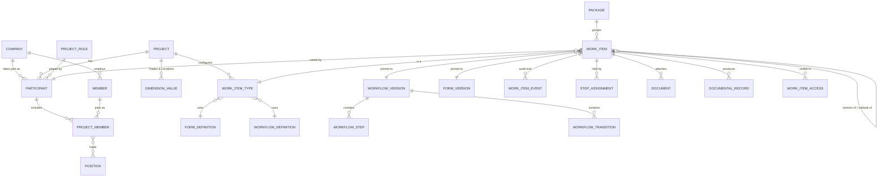

# Rabaed data model (Project Module, v1 draft)

The logical data model for the platform and the Project Module, in PostgreSQL terms. Names follow [CONTEXT.md](../CONTEXT.md). Schedule, Tendering and Financial are out of scope. Each Instance (standard / KSA) runs this same schema independently.

## Conventions

- **IDs** are UUIDv7 (time-sortable, safe to expose, no enumeration).
- **Bilingual content** entered by customers (names, labels) is stored as `i18n jsonb` (`{"en": "...", "ar": "..."}`), so further languages can be added without schema changes. UI strings are *not* in the database; they are translation keys (Lokalise).
- **Library pattern.** Forms, Workflows, Work Item Types, Positions, Trades and Scopes exist at three levels: `owner_kind ∈ {rabaed, company, project}` + `owner_id`. Using one always **copies** it down a level (`copied_from_id` keeps provenance). Nothing is linked live.
- **Nothing is hard-deleted.** Rows are deactivated, withdrawn, cancelled or closed.
- **Every table carries** `created_at`, `created_by`, `updated_at`. Change history for regulated tables goes to the audit log (§9).
- `→` means foreign key.

## Core relationships

---

## 1. Platform and tenancy

Tenancy is per Project (ADR 0007): every Project-owned table has `project_id` and a row-level-security policy that allows rows only for Projects the current Member participates in. Company-owned tables have `company_id` and a policy limited to the Member's own Company.

**company**
`id`, `legal_name i18n`, `cr_number` (unique), `vat_number` (unique), `status {active, suspended}`, `authorized_person_id → member` (exactly one; nullable only while onboarding), `onboarded_by → rabaed_engineer`.

**member**
`id`, `company_id → company`, `email` (unique per Instance), `full_name i18n`, `phone`, `locale`, `status {invited, active, locked, deactivated}`, `can_create_projects bool` (= Project Creator), `auth_subject` (identity-provider link).
A Member never moves between Companies. Changing employer means a new Member.

**member_signature**
`id`, `member_id`, `file_id → stored_file`, `active_from`, `active_to`.
This table is versioned: every signing event points at the exact signature row that was in force, so replacing a signature never changes old records. Signing is blocked while a Member has no active row.

**authorized_person_transfer**
`company_id`, `from_member_id`, `to_member_id`, `by_engineer_id`, `reason`, `at`.

## 2. Projects and participation

**project**
`id` (UUIDv7, internal and used in URLs), `host_company_id → company` (whose subscription it counts against), `project_number` (per Host Company: 1, 2, 3…, unique `(host_company_id, project_number)`), `code` (short, editable, used in Document Numbers), `name i18n`, `status {active, closed}`, `closed_at`, `planned_completion` (date, nullable; shown as plain text, never counted down or flagged), `creator_member_id`, `record_language {ar, en, bilingual}`, `origin {direct, tender}`, `tender_ref` (nullable, future).

**company_project_counter**
`company_id`, `last_project_number`. Incremented in the same transaction that creates the Project.

**project_admin**
`project_id`, `member_id`, `appointed_by` (member or engineer).

**project_role**
`id`, `owner_kind/owner_id` (Rabaed defaults + project custom), `base_role {contractor, consultant, owner, owner_representative}`, `name i18n`, `code`.
A custom role (Subcontractor, PMC…) must name a `base_role`. Permission checks cap at what the base role allows.

**participant**
`id`, `project_id`, `company_id`, `project_role_id`, `status {active, withdrawn}`, `withdrawn_at`, `withdrawn_by`.
Unique `(project_id, company_id)`. Withdrawal cancels the participant's in-progress Work Items in one transaction (§5).

**project_member**
`id`, `participant_id`, `member_id`, `status {active, removed}`, `removed_at`.
Removal never deletes access to what the Member signed (§10).

**position** / **position_permission** / **project_member_position**
- `position`: `id`, `owner_kind/owner_id`, `base_role`, `name i18n`, `copied_from_id`.
- `position_permission`: `position_id`, `permission {view, create, submit, review, approve, assign, close, attach}`, `module_key`, `work_item_type_id` (null = whole Module).
- `project_member_position`: `project_member_id`, `position_id` (many-to-many).

## 3. Visibility, Trades, Locations, Scopes

Trades, Locations and any future dimension share one generic structure, so adding a Visibility Dimension is data, not code.

**visibility_dimension**
`id`, `project_id`, `kind {trade, location, custom}`, `name i18n`, `required_on_work_items bool`.
Every Project gets `trade` (required) and `location` at creation.

**dimension_value**
`id`, `dimension_id`, `parent_id` (Location tree: Zone → Building → Floor; flat for Trades), `level_name i18n` (e.g. "Floor"), `code` (2–6 chars, used in numbering), `name i18n`, `copied_from_id` (Rabaed default Trade list), `sort`.

**location_shape**
`dimension_value_id`, `map_file_id → stored_file` (site map or plan image), `polygon jsonb`. Drives the Zone/Plan View.

**location_plan**
`dimension_value_id`, `drawing_id → drawing`. The plan Drawings of a Location, used for Pins.

**scope**
`id`, `trade_value_id → dimension_value`, `parent_id` (null = Scope; set = Sub-scope), `code`, `name i18n`, `owner_kind/owner_id`.
Rabaed defaults are copied per Project, and only Project Admins add more.

**visibility_grant** / **visibility_grant_value**
- `visibility_grant`: `id`, `subject_kind {participant, project_member}`, `subject_id`, `dimension_id`, `is_all bool`.
- `visibility_grant_value`: `grant_id`, `dimension_value_id`. Granting a Location includes its whole subtree.

The rule "a Member's grant ⊆ their Participant's grant" is enforced on write. A **Visibility Gap** is a query: any dimension value (per role) that no active Participant covers.

## 4. Engines: Forms, Workflows, Work Item Types

**module**: fixed in code: `submittals, inspections, snag_list, site_reports, drawings`.

**stage**
`id`, `project_id`, `module_key`, `key` (stable, e.g. `pending_approval`), `name i18n`, `category {draft, in_progress, closed_positive, closed_negative, cancelled}`, `sort`.
This is the shared set per Module. Workflows reference Stages by `key`, so library Workflows work in any Project.

**form_definition** / **form_version**
- `form_definition`: `id`, `owner_kind/owner_id`, `name i18n`, `copied_from_id`.
- `form_version`: `id`, `form_definition_id`, `version_no`, `status {draft, published}`, `schema jsonb`, `published_at`.
- `schema` holds the fields (type, `label i18n`, validation, options) and sections. It includes the field types `checklist`, `photo`, `boq_quantities` (future), `pick_list` (sources: Approved Supplier List, dimension values…) and `aggregate` (e.g. Weekly pulling totals from issued Dailies).
- Published versions are immutable.

**checklist_template**
`id`, `owner_kind/owner_id`, `name i18n`, `items jsonb`, `copied_from_id`. Copied into Forms, never linked (see form-engine.md §3).

**pdf_template** / **pdf_template_version**
- `pdf_template`: `id`, `owner_kind/owner_id`, `form_definition_id` (null = generic), `name i18n`, `style {portal, paper, custom}`, `copied_from_id`.
- `pdf_template_version`: `id`, `pdf_template_id`, `version_no`, `status`, `html`, `css`, `bindings jsonb`, `authored_by` (member or engineer).
`work_item_type.pdf_template_id` picks the template per Project. `documental_record.pdf_template_version_id` records which one sealed it.

**workflow_definition** / **workflow_version**
- `workflow_definition`: `id`, `owner_kind/owner_id`, `name i18n`, `copied_from_id`.
- `workflow_version`: `id`, `workflow_definition_id`, `version_no`, `status {draft, published}`, `layout jsonb` (React Flow node positions only), `published_at`. Published versions are immutable.

**workflow_step**
`id`, `workflow_version_id`, `key`, `name i18n`, `stage_key`, `actor_rule jsonb`, `is_signing bool`, `outcome_mode {none, recommend_code, issue_code, inspection_result}`.
- `actor_rule` says who can hold the Step: base role or project role, required permission (e.g. `approve`), and optional default assignee resolution. The Participant is resolved at runtime from the item's Visibility values; that is how "Electrical goes to Consultant A" works.
- `issue_code` marks the final review Step.

**workflow_transition**
`id`, `workflow_version_id`, `from_step_id`, `to_step_id`, `label i18n`, `kind {send, submit, return, close, cancel}`, `outcome` (nullable: `A, B, C, D, passed, passed_with_comments, failed, closed`; required when `to_step` is terminal), `permission`, `offers_assign_to bool`, `condition jsonb`, `action_form jsonb`, `notifications jsonb`.
- `kind = submit` marks a hand-over between Participants.
- `condition`: routing on Form field values, e.g. `cost_impact > 500000`.
- `action_form`: the pop-up form schema, e.g. pick a Review Code, comments, files.
- `notifications`: who gets what, on which channel.

**work_item_type**
`id`, `project_id`, `module_key`, `code` (MAR, SAR, DAR…), `name i18n`, `form_definition_id`, `workflow_definition_id`, `outcome_kind {review_code, inspection_result, none}`, `required_links jsonb`, `expected_frequency {none, daily, weekly, monthly}`, `allows_subtasks bool`, `copied_from_id`.
New items use the latest *published* versions of the Form and Workflow at creation time.

**step_default_holder**
`project_id`, `participant_id`, `work_item_type_id`, `step_key`, `member_id`. Set by each Participant for its own Steps.

**outbox**
`id`, `kind` (notification, documental_record, email, package_recompute…), `payload jsonb`, `created_at`, `processed_at`, `attempts`, `last_error`. Written in the same transaction as the command that caused it.

**numbering_pattern**
`id`, `project_id`, `work_item_type_id` (null = Project default), `segments jsonb` (≤ 6 of: project code, type code, trade, company, location level, custom literal), `separator`, `seq_digits (3–7)`, `seq_scope jsonb` (which segments the counter counts separately for), `effective_from`.
A pattern change creates a new row, and old numbers stay as issued.

**numbering_counter**
`project_id`, `counter_key` (resolved prefix), `last_value`.
Incremented with `UPDATE … RETURNING` in the same transaction as the first Send or Submit, so there are no gaps and no reuse.

## 5. Work Items

**work_item**

| column | notes |
|---|---|
| `id`, `project_id`, `work_item_type_id` | |
| `raised_by_participant_id`, `created_by_member_id` | |
| `title`, `data jsonb` | Form answers, validated against `form_version.schema` |
| `form_version_id`, `workflow_version_id` | pinned forever |
| `document_number` | null while Draft; set at first leaving Draft |
| `revision_no` (0 = original), `revision_of_id`, `root_id` | Revision chain; display `MS-003 Rev 1` |
| `parent_id` | Subtask; check: parent's `parent_id` is null |
| `package_id` | nullable |
| `current_step_id`, `current_stage_key`, `step_entered_at` | `step_entered_at` feeds **Step Age** |
| `outcome` | `A, B, C, D, passed, passed_with_comments, failed, cancelled, closed`; null while open |
| `recommended_code` | latest recommendation, informational |
| `closed_at` | |

**work_item_dimension_value**
`work_item_id`, `dimension_id`, `dimension_value_id`. Exactly one value per dimension, and Trade is required.

**work_item_field_value** (reporting projection)
`work_item_id`, `field_key`, `value_text`, `value_num`, `value_date`. Written on save for `reportable` fields only, and under the same RLS as `work_item`.

**work_item_scope**
`work_item_id`, `scope_id`. Many allowed; all must sit under the item's Trade.

**step_assignment**
`id`, `work_item_id`, `step_id`, `participant_id`, `assignee_member_id` (null = in the Step Pool), `status {pooled, claimed, done, vacant, reassigned}`, `claimed_at`, `done_at`.
When an assignee is removed from the Project, the row becomes `vacant`, and the Company's Authorized Person is notified.

**work_item_access** (materialized, maintained by the engine)
`work_item_id`, `participant_id`, `since`, `reason {raised, handling, oversight}`.
- A Participant gets a row when it raises the item, when a Step is first assigned to it, or (Owner / Owner Representative) on first Submit if the item is within their Visibility.
- Row-level security joins this table with the Member's own Visibility grant. This keeps "Contractor B never sees Contractor A's submittals" a cheap, indexable check instead of a runtime rule walk.

**work_item_link**
`id`, `from_id`, `to_id`, `kind {related, raised_from, relies_on}`, `created_by`.
- A `relies_on` link satisfies `required_links`.
- A viewer without access to the target may open only the target's latest Documental Record.

**chat_message**
`id`, `work_item_id`, `author_member_id`, `participant_id`, `body`, `file_ids`, `created_at`. Insert-only.

**package**
`id`, `project_id`, `participant_id`, `name i18n`, `scope_id` (optional), `status {open, in_progress, closed}`.
Status is recomputed on every member item's closure. The Package is Closed when every *latest revision* in it is A or B.

## 6. Documents, signing, Documental Records, distribution

**stored_file**
`id`, `storage_key` (object storage), `sha256`, `size`, `mime`, `uploaded_by`, `created_at`. Immutable.

**document**
`id`, `work_item_id`, `stored_file_id`, `frozen_at`.
Frozen at the first Send or Submit. After that the row can't change, and a change needs a Revision.

**documental_record**
`id`, `work_item_id`, `stored_file_id`, `pdf_template_version_id`, `language`, `outcome`, `content_sha256`, `sealed_at`, `verification_code` (QR target).
Produced on every closure. The PDF includes every signing event and the cross-Participant events, but no Internal Communication and no Chat. It is sealed with PAdES and a trusted timestamp (ADR 0003).

**distribution_list** / **distribution_recipient**
- `distribution_list`: `id`, `project_id`, `work_item_type_id`.
- `distribution_recipient`: `list_id`, `member_id` or `email`.
- Per-item overrides are copied onto the item at issue.

**record_delivery**
`id`, `documental_record_id`, `recipient`, `token_hash`, `expires_at`, `sent_at`, `delivered_at`, `first_opened_at`, `open_count`. This is the Delivery Log.

## 7. Drawings, Markups, Pins

**drawing**
`id`, `project_id`, `participant_id`, `number`, `title i18n`, trade + location dimension values, `current_revision_id`.

**drawing_revision**
`id`, `drawing_id`, `rev_label`, `stored_file_id`, `review_work_item_id` (the drawing-submittal that carries it), `status {under_review, current, superseded, rejected}`.
Overlay compare works on any two revisions of the same Drawing.

**markup**
`id`, `drawing_revision_id`, `review_work_item_id`, `author_member_id`, `participant_id`, `geometry jsonb`, `body`, `status {open, answered, closed}`, `carried_from_id` (Markup on the previous revision), `became_comment_id → work_item` (on Code B).

**markup_reply**
`id`, `markup_id`, `author_member_id`, `kind {fixed, reply}`, `body`, `created_at`.
The resubmit transition is blocked while any carried Markup has no reply.

**pin**
`work_item_id` (unique), `drawing_revision_id`, `x`, `y` (normalised 0–1). Pins survive new revisions by staying on their original sheet.

## 8. Files, Approved Suppliers, reports

**folder**
`id`, `project_id`, `owner_participant_id`, `parent_id`, `name`, `kind {work_item, free}`, `work_item_id`.
A `work_item` folder is virtual: its contents and permissions come from the Work Item, so it can never show more than the item itself.

**folder_permission**
`folder_id`, `participant_id` or `project_member_id`, `level {view, edit}`.

**free_file** / **file_version**
- `free_file`: `id`, `folder_id`, `name`, `current_version_id`.
- `file_version`: `id`, `free_file_id`, `version_no`, `stored_file_id`, `uploaded_by`.

**approved_supplier**
`id`, `project_id`, `name`, `trade_value_id`, `scope_id`, `source {preloaded, submittal}`, `source_work_item_id`, `status {approved, withdrawn}`.

**report_gap_decision**
`work_item_type_id`, `participant_id`, `period_date`, `decision {added_late, ignored}`, `by`, `at`. Gaps themselves are computed from `expected_frequency`.

**submittal_register_import**
`id`, `project_id`, `participant_id`, `source_file_id`, `mapping jsonb`, `status`, `rows_created`, `run_by` (member or engineer).
Each created Draft carries `import_id` for traceability.

## 9. Audit trail, notifications, admin

**work_item_event**: append-only, and it is the legal trail.

| column | notes |
|---|---|
| `id`, `work_item_id`, `seq` | `seq` is gap-free per item |
| `type` | `created, transition, recommend_code, issue_code, assigned, claimed, vacated, admin_reassigned, admin_reset, internal_note, cancelled` |
| `actor_member_id` / `actor_engineer_id` | exactly one |
| `actor_participant_id` | |
| `transition_id`, `from_step_id`, `to_step_id` | |
| `payload jsonb` | Action Form answers, code, note text |
| `audience` | `shared` or `internal` |
| `audience_participant_id` | set when `audience = internal` |
| `signature_id → member_signature` | set when the event signs |
| `content_sha256` | hash of item data + documents at that moment |
| `prev_hash`, `hash` | hash chain → tamper-evident |
| `created_at` | |

- The database role used by the app has `INSERT` only on this table: no `UPDATE` or `DELETE`.
- Internal Communication = `audience = internal`, shown only to that Participant's Members.
- Rabaed Engineers' events are always `shared` and always carry a reason.

**project_event**: append-only project-level events (participant added or withdrawn, settings changed, Workflow version published). Together with `work_item_event` it forms the **Activity Feed**, filtered by access and Visibility.

**notification** / **notification_preference**: in-app inbox and per-Member channel settings (email now, WhatsApp later).

**rabaed_engineer**: separate identity table. Engineers are never Members.

**admin_action**: `id`, `engineer_id`, `action`, `target_kind/target_id`, `reason` (required), `before jsonb`, `after jsonb`, `at`.
Allowed actions are an explicit list: reassign, reset step, transfer Authorized Person, unlock, run import, fix visibility, publish library template.

**job**: background jobs (PDF sealing, imports, deliveries) with status and error, which is the Job Monitor.

## 10. Access rules that cut across tables

1. **Seeing a Work Item** requires all three:
   - an active `project_member`,
   - a `work_item_access` row for the Member's Participant,
   - the Member's Visibility covering every dimension value of the item.

   If the item is still in the raising Participant's internal Steps, only that Participant qualifies.
2. **Signatory Access** is a query, not a copy: every `work_item_event` with `signature_id` whose `actor_member_id` is you entitles you to that item's Documental Records and the Project's name. This holds even when you're removed or the Project is Closed. The same applies to your Company's Authorized Person.
3. **Closed Project**: every write path checks `project.status = active`.
4. **Withdrawn Participant**:
   - in one transaction, every open item with `raised_by_participant_id` = it gets a `cancelled` event, `outcome = cancelled` and a Documental Record;
   - open `step_assignment` rows for it are closed.
5. **Rabaed Engineers** go through `admin_action` only. They have no path to insert `issue_code`, `recommend_code` or `transition` events.

## Settled points

- **Oversight:** Owner and Owner Representative get access at first Submit, within their Visibility (`reason = oversight`). See docs/visibility.md V2.
- **Snags assigned to a Contractor:** the Contractor sees the shared history only, never the raiser's internal events (V5).
- **Search:** Postgres full-text search first, always filtered through RLS.
