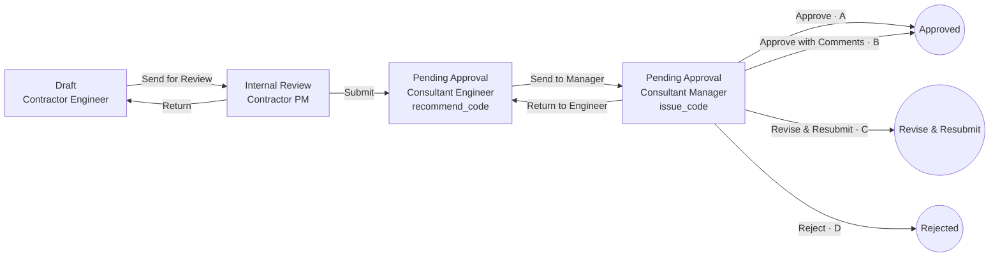

# Workflow engine design

How Work Items move through Workflows. Terms follow [CONTEXT.md](../CONTEXT.md); tables follow [data-model.md](data-model.md); every read and write obeys [visibility.md](visibility.md). The engine is built in-house on PostgreSQL ([ADR 0008](adr/0008-in-house-workflow-engine-on-postgres.md)).

The engine has two halves:
- **Definition time:** the visual builder, validation and publishing.
- **Run time:** one command, `take_transition`, plus a few supporting commands (§5), all executed as single database transactions.

---

## 1. Definition model

A Workflow version is a directed graph.

- **Steps** are nodes. Each has:
  - a `stage_key`, which decides its Kanban column;
  - an **actor rule**: who may hold it (§3);
  - an `outcome_mode`: `none`, `recommend_code`, `issue_code` or `inspection_result`;
  - `is_signing`.
- **Transitions** are edges. Each has:
  - a `label` (i18n);
  - a `kind`: `send` (within the Participant), `submit` (to another Participant), `return` (back within the Participant), `close` or `cancel`;
  - an optional `condition` (§4);
  - an optional `outcome` it sets (`A`, `B`, `C`, `D`, `passed`, `passed_with_comments`, `failed`, `closed`);
  - an `action_form`: the pop-up schema;
  - `notifications`.
- **Start:** every Workflow has exactly one **Draft** Step (Stage category `draft`) where items are created.
- **End:** terminal Steps sit in Stages of category `closed_positive`, `closed_negative` or `cancelled`. Reaching one closes the item.

### Example: Rabaed Default "Material Submittal (MAR)"



The Issued Code is the `outcome` of the Transition taken from the `issue_code` Step. The "Approve / B / C / D" buttons are four Transitions, each with its own Action Form. For example, B requires at least one comment row, and each row becomes a Comment Work Item.

### Publish-time validation

A draft Workflow version can't be published unless all of these hold:

1. Exactly one Draft start Step. Every Step is reachable from it, and every non-terminal Step has an outgoing Transition.
2. Every `stage_key` exists in the Module's Stage set, and terminal Steps sit in closed or cancelled Stages.
3. The Work Item Type's `outcome_kind` matches: for `review_code`, exactly one path passes an `issue_code` Step, and every Transition into a terminal Step sets an outcome.
4. A `return` goes only to an earlier Step held by the **same** Participant role. A `submit` always crosses to a different role.
5. Every `submit` Transition and every Transition from an `issue_code` Step is signing.
6. Conditions reference only fields that exist in the Form (checked against the Form's latest published version).
7. Action Forms are valid Form schemas.
8. No cycle is possible without a `return`. There are no loops through Submit.

Published versions never change. Publishing v2 leaves v1 items untouched. Items on v1 show a notice ("Workflow updated to v2"), and anyone can view v2.

---

## 2. Run-time state

The state lives on `work_item`:
- `current_step_id`, `current_stage_key`, `step_entered_at` (for Step Age);
- `participant_entered_at`, `participant_entered_step_id`: when, and at which Step, it reached the holding Participant (§10);
- `outcome`, `closed_at`.

The current holder is the single open `step_assignment` row.

History is the append-only `work_item_event` chain. Every command appends exactly one or more events with `prev_hash → hash`.

---

## 3. Who holds a Step (actor resolution)

When an item enters a Step, the engine resolves the holder in three stages.

**3.1 Participant.** The actor rule names a base or Project Role, for example "Consultant".
- If the role is the raiser's own role, the Participant is the raiser.
- Otherwise the candidates are active Participants in that role whose Visibility covers **all** the item's dimension values (Trade, Location…):
  - **1 candidate:** chosen.
  - **More than 1:** the person taking the Submit picks one in the Action Form. Project Settings also shows a **Visibility Overlap** warning, since this usually means misconfiguration.
  - **0 candidates:** a Visibility Gap. The Transition isn't offered, and taking it is refused with the same answer as for more than one candidate or an empty Step Pool (§3.2): `next_step_unavailable`, shown as "This can't be handed over yet: the next step has nobody to take it. Ask a Project Admin." The answer never says which case it is, nor names another Participant, Trade or Location (visibility.md, "Refusals of a Transition"; V14, V16). Separately, Project Admins get a Visibility Gap warning, computed from Participant grants only (V16).

**3.2 Step Pool.** The pool is the active Project Members of that Participant who:
- hold a Position with the rule's required permission (e.g. `review`, `approve`) for this Work Item Type, and
- have Visibility covering the item.

**3.3 Default assignee.** The first rule that yields a pool member wins:
1. The person who held this Step before, when coming back by `return`.
2. A person the previous actor picked in the Action Form, if the Transition offers "Assign to".
3. The Participant's **default holder** for this Step, set in Project Settings by that Participant (e.g. "Contractor PM: Ali").
4. Otherwise the item stays **pooled**. Everyone in the pool sees it under "Need My Action", and one of them **claims** it.

---

## 4. Conditions (routing)

A condition is a small JSON rule over three sources: the item's Form data, the current Action Form answers, and item attributes (Trade, Location, Work Item Type). Example:

```json
{ "all": [ { "field": "cost_impact", "op": ">", "value": 500000 },
           { "attr": "trade", "op": "in", "value": ["EL", "ME"] } ] }
```

- Operators: `= != > >= < <= in not_in empty not_empty`, plus `all`, `any` and `not`. There is no code and no scripting.
- When several Transitions share a label and source Step, exactly one must match at run time. Publish validation warns when conditions can overlap or leave a gap. If none matches at run time, the action is blocked with a clear message.

---

## 5. Commands

Every command runs in **one transaction**:
- it locks the item row (`SELECT … FOR UPDATE`);
- it takes an **idempotency key**, so a double-click can't apply twice;
- it writes side effects (notifications, PDF jobs, emails) to an **outbox** table in the same transaction, and workers deliver them afterwards.

### 5.1 `take_transition(item, transition, action_form_answers, confirm_signing?)`

Checks, in order. Any failure aborts with nothing written.

1. The item is open, the Project is Active, and the caller is an active Project Member who can see the item (visibility layers 2–4).
2. The caller holds the current assignment (claimed, or default-assigned).
3. The Transition starts from the current Step on the item's **pinned** Workflow version, and its condition matches.
4. The caller holds the permission the Transition needs.
5. The Action Form answers validate. With Code B, there is at least one comment.
6. **Signing:** if the Transition is signing, the caller has an active `member_signature` and `confirm_signing = true` from the confirmation pop-up.
7. **On `submit`:**
   - required Links exist, and are approved where required;
   - all Form-required fields are complete;
   - for a Revision of a drawing submittal, every carried Markup has a reply.
8. Actor resolution for the target Step succeeds (§3).

Effects, in order:

1. **First exit from Draft:**
   - the Document Number is assigned (§8);
   - all Documents are frozen (`frozen_at`, content hashed).
2. The event is appended. It records:
   - type `transition` (or `recommend_code` / `issue_code`);
   - the Action Form payload;
   - `audience`: `shared` if the Transition is `submit`, closes the item, or comes from an `issue_code` Step; otherwise `internal` to the actor's Participant;
   - `signature_id` if signing;
   - a `content_sha256` of the item data plus its frozen Documents;
   - the hash chain.

   An Internal Note written in the Action Form is its own `internal_note` event, appended just before the Transition's, carrying the Transition's id. It is always `internal` to the actor's Participant, even with a Submit or a Code (visibility.md V5).
3. The current assignment is closed (`done`).
4. The item moves: `current_step_id`, `current_stage_key` and `step_entered_at` are set. If it leaves the acting Participant (handed to another, or closed), `participant_entered_at` and `participant_entered_step_id` are set too. The event is `shared` when the item leaves the acting Participant (a Submit or a close always does); a move inside one Participant is `internal`, even from a Step that issues Codes.
5. **If the new Step is non-terminal:** a new assignment is created (§3), and `work_item_access` is granted to the holder's Participant (`handling`). On the first `submit`, oversight access is granted to Owner and Owner Representative Participants whose Visibility covers the item.
6. **If the new Step is terminal:**
   - `outcome` and `closed_at` are set;
   - outcome hooks run (§6);
   - a Documental Record job is written to the outbox (§7);
   - the Package status is recomputed;
   - the parent is re-checked (a parent can't close while Subtasks are open, so that check is also a precondition when the parent itself closes).
7. Notifications for the Transition go to the outbox. Recipients are re-checked against visibility at send time.

### 5.2 `claim(item)` / `release(item)`

- Claim takes a pooled assignment. It uses a conditional update, so only one claimer wins.
- Release returns it to the pool.
- Both append internal events.

### 5.3 `recommend_code(item, code, note)`

- Only on a `recommend_code` Step, usually as part of that Step's forward Transition Action Form.
- It is stored as an internal event, and `recommended_code` is updated.
- It is never visible outside the Participant.

### 5.4 `create_revision(closed_item)`

- **Allowed when:** the latest revision's outcome is `C` or `failed`, and the caller's Participant raised it.
- **Creates** a new item:
  - `revision_of_id` = the closed item, `root_id` kept, `revision_no + 1`;
  - Form data copied, Documents copied as new unfrozen rows;
  - pinned to the **latest published** Form and Workflow versions, with a notice if they changed;
  - starts at Draft;
  - keeps the same Document Number base with the `Rev n` suffix;
  - Drawing Markups carried over as open items needing replies.
- The closed item stays closed and gains a `related` Link to the new one.

### 5.5 `replace_rejected(closed_item)` for Code D

This creates a **new** item with a new Document Number and a `related` Link to the rejected one. Rejected items never get Revisions.

### 5.6 Admin commands (Rabaed Admin only, `admin_action` + a shared event with a reason)

- `admin_reassign(item, member)`: moves the open assignment to another pool member.
- `admin_reset_step(item)`: re-creates the current Step's assignment and clears a stuck claim. The Step, Stage and outcome don't change.

There is no admin path to `take_transition`, `recommend_code`, `issue_code`, or changing the Workflow version.

---

## 6. Outcome hooks

| Outcome | Effect |
|---|---|
| A | Approved. If the item is a supplier submittal, an Approved Supplier List entry is added. If it's a drawing submittal, its Drawing Revision becomes current and the previous one is superseded. |
| B | As for A, plus one **Comment** Work Item per comment row (and per open Markup). Each is `raised_from`-linked, assigned per the Comment type's Workflow. "All comments closed" is tracked on the source item. |
| C | Closed with a "Create Revision" action available to the raiser. |
| D | Closed with a "Create replacement" action. |
| passed / passed_with_comments | Like A / B, for Inspections. |
| failed | Like C: re-inspection by Revision. |
| cancelled | Closed. Open Subtasks are cancelled too. |

---

## 7. Signing and the Documental Record

- **At each signing Transition:** the event stores `signature_id` (the exact signature version) and a `content_sha256`, and joins the hash chain.
- **At closure,** a background job:
  1. renders the Form and the Action Form history into an HTML template, then to PDF in the Project's record language;
  2. appends frozen PDF and image Documents. Other file types, such as DWG, are listed with their hashes, and their original files remain downloadable in the portal;
  3. adds a signing-trail page: every signing event with name, Position, Company, time and content hash, plus the cross-Participant events. There is no Internal Communication and no Chat;
  4. seals the PDF with PAdES using a KMS-held key, adds an RFC 3161 timestamp, and embeds a QR code to the verification page;
  5. stores the file and its hash as a `documental_record`, then sends it to the Distribution List through expiring links.
- A job failure never rolls back the closure. The job retries and shows in the Job Monitor.

---

## 8. Document Numbers

- The number is assigned inside `take_transition` at the first exit from Draft:
  1. resolve the Project's numbering pattern for the Type;
  2. build the counter key from the segments the sequence is scoped by;
  3. run `UPDATE numbering_counter … RETURNING` in the same transaction.
- A rollback releases nothing, because nothing was committed, so there are no gaps.
- Revisions reuse the base number with the `Rev n` suffix.

---

## 9. People and companies leaving

- **Member removed from the Project:**
  - their claimed or default assignments become `vacant`;
  - the item waits at the same Step;
  - their Company's Authorized Person is notified to name a replacement.
  - `assign_vacancy(item, member)` (Authorized Person or Rabaed Admin) fills it with a pool member.
- **Participant withdrawn:** every open item it raised gets a `cancelled` event, outcome `cancelled`, and a Documental Record. Its open assignments on other companies' items become Participant-level Vacancies. They pass to the replacement Participant's pool once one covering the item is added.

---

## 10. Step Age and "Need My Action"

- **Step Age** = weeks since `step_entered_at`, shown as up to 4 dots, for the holding Participant's own Members. Every other Company counts it from `participant_entered_at` and sees the Step it arrived at, so internal moves never reset or reveal anything (visibility.md V14). `app.step_as_seen` is the one place that chooses.
- A weekly job builds each Participant's ageing report from the items it can see, through `app.step_as_seen` too.
- **"Need My Action"** = open assignments where the viewer is the assignee, or is in the pool and nobody has claimed it.

---

## 11. Builder (React Flow) contract

- The editor saves a **draft** `workflow_version` in these parts:
  - `layout jsonb`: node positions only;
  - `workflow_step` rows;
  - `workflow_transition` rows.
- Stages appear as horizontal swim-bands, and Steps are dropped into a band.
- The side panel edits the selected node or edge: actor rule, outcome mode and signing (Steps); label, kind, condition, outcome, Action Form (using the Form builder component) and notifications (Transitions).
- "Validate" runs the §1 checks live, and "Publish" runs them again server-side.

---

## Settled (2026-09-26)

1. **Consultant withdrawn while holding a Contractor's item:** the item is not cancelled. The assignment becomes a Participant-level **Vacancy**. When a new Participant in that role covering the item's Visibility is added, the item goes to that Participant's Step Pool. Only items the withdrawn Participant *raised* are cancelled.
2. **No parallel review in v1.** Workflows are sequential. Parallel branches ("all must approve") are a v2 engine feature.
3. **Default holders are allowed.** Each Participant can set a default holder per Step in Project Settings (§3.3, rule 3).
