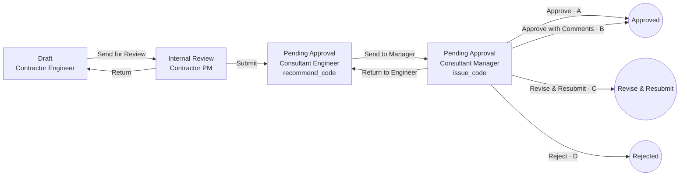

# Workflow engine design

How Work Items move through Workflows. Terms follow [GLOSSARY.md](../GLOSSARY.md); tables follow [data-model.md](data-model.md); every read and write obeys [visibility.md](visibility.md). The engine is built in-house on PostgreSQL ([ADR 0008](adr/0008-in-house-workflow-engine-on-postgres.md)).

The engine has two halves:
- **Definition time:** the visual builder, validation and publishing.
- **Run time:** one command, `take_transition`, plus a few supporting commands (§5), all executed as single database transactions.

---

## 1. Definition model

A Workflow version is a directed graph.

- **Steps** are nodes. Each has:
  - a `stage_key`, which decides its Kanban column;
  - an **actor rule**: who may hold it (§3);
  - an `outcome_mode`: `none`, `recommend_code`, `issue_code` or `inspection_result`;
  - `is_signing`.
- **Transitions** are edges. Each has:
  - a `label` (i18n);
  - a `kind`: `send` (within the Participant), `submit` (to another Participant), `return` (back within the Participant), `send_back` (back to the Participant that Submitted it, with no outcome; ADR 0014), `close` or `cancel`;
  - an optional `condition` (§4);
  - an optional `outcome` it sets (`A`, `B`, `C`, `D`, `passed`, `passed_with_comments`, `failed`, `closed`);
  - an `action_form`: the pop-up schema;
  - `notifications`.
- **Start:** every Workflow has exactly one **Draft** Step (Stage category `draft`) where items are created.
- **End:** terminal Steps sit in Stages of category `closed_positive`, `closed_negative` or `cancelled`. Reaching one closes the item.

### Example: Rabaed Default "Material Submittal (MAR)"



The MAR has no Send Back: the Consultant sends work back to the Contractor only with Code C, and the Contractor resubmits it as a Revision (§5.4). Send Back is for Workflows such as the Site Report's "Return for Comment" (ADR 0014).

The Issued Code is the `outcome` of the Transition taken from the `issue_code` Step. The "Approve / B / C / D" buttons are four Transitions, each with its own Action Form. For example, B requires at least one comment row, and each row becomes a Comment Work Item.

### Publish-time validation

A draft Workflow version can't be published unless all of these hold:

1. Exactly one Draft start Step. Every Step is reachable from it, and every non-terminal Step has an outgoing Transition.
2. Every `stage_key` exists in the Module's Stage set, and terminal Steps sit in closed or cancelled Stages.
3. The Work Item Type's `outcome_kind` matches: for `review_code`, exactly one path passes an `issue_code` Step, and every Transition into a terminal Step sets an outcome.
4. A `return` goes only to an earlier Step held by the **same** Participant role. A `submit` always crosses to a different role. A `send_back` goes from a Step of the role the item was Submitted to, back to a Step of the role that Submitted it, which the Workflow chooses; it sets no outcome.
5. Every `submit` Transition and every Transition from an `issue_code` Step is signing.
6. Conditions reference only fields that exist in the Form (checked against the Form's latest published version).
7. Action Forms are valid Form schemas. As built (RP-300): `workflowActionFormProblems` in `packages/domain` (`action-form.ts`). Workflow Versions are published as data by migration until the builder (part 5), so a seam test runs it on every published Version.
8. No cycle is possible without a `return` or a `send_back`. A loop across Participants always goes through a `send_back`, never through Submit alone.

As built (RP-334): checks 4 and 8 are `workflowKindProblems` in `packages/domain` (`workflow-publish.ts`), run like check 7 on every published Version by a seam test. A Step's role is its actor rule's `base_role`; a `send_back` is valid from a Step of role A to a Step of role B when some `submit` goes from a Step of B to a Step of A. The database also refuses a `send_back` with an outcome (`workflow_transition_send_back_no_outcome`), and `take_transition` raises on a `return` that would cross Participants. The seam suites' test Workflow with a Send Back is `addSendBackWorkflow` (`packages/db/test-support`).

Published versions never change. Publishing v2 leaves v1 items untouched. Items on v1 show a notice ("Workflow updated to v2"), and anyone can view v2.

---

## 2. Run-time state

The state lives on `work_item`:
- `current_step_id`, `current_stage_key`, `step_entered_at` (for Step Age);
- `participant_entered_at`, `participant_entered_step_id`: when, and at which Step, it reached the holding Participant (§10);
- `outcome`, `closed_at`.

The current holder is the single open `step_assignment` row.

History is the append-only `work_item_event` chain. Every command appends exactly one or more events with `prev_hash → hash`.

---

## 3. Who holds a Step (actor resolution)

When an item enters a Step, the engine resolves the holder in three stages.

**3.1 Participant.** The actor rule names a base or Project Role, for example "Consultant".
- If the role is the raiser's own role, the Participant is the raiser.
- Otherwise the candidates are active Participants in that role whose Visibility covers **all** the item's dimension values (Trade, Location…):
  - **1 candidate:** chosen.
  - **More than 1:** the person taking the Submit picks one in the Action Form. Project Settings also shows a **Visibility Overlap** warning, since this usually means misconfiguration.
  - **0 candidates:** a Visibility Gap. The Transition isn't offered, and taking it is refused with the same answer as for more than one candidate or an empty Step Pool (§3.2): `next_step_unavailable`, shown as "This can't be handed over yet: the next step has nobody to take it. Ask a Project Admin." The answer never says which case it is, nor names another Participant, Trade or Location (visibility.md, "Refusals of a Transition"; V14, V16). Separately, Project Admins get a Visibility Gap warning, computed from Participant grants only (V16).

**3.2 Step Pool.** The pool is the active Project Members of that Participant who:
- hold a Position with the rule's required permission (e.g. `review`, `approve`) for this Work Item Type, and
- have Visibility covering the item.

**3.3 Default assignee.** The first rule that yields a pool member wins:
1. The person who held this Step before, when coming back by `return` or `send_back`.
2. A person the previous actor picked in the Action Form, if the Transition offers "Assign to".
3. The Participant's **default holder** for this Step, set in Project Settings by that Participant (e.g. "Contractor PM: Ali").
4. Otherwise the item stays **pooled**. Everyone in the pool sees it under "Need My Action", and one of them **claims** it.

---

## 4. Conditions (routing)

A condition is a small JSON rule over three sources: the item's Form data, the current Action Form answers, and item attributes (Trade, Location, Work Item Type). Example:

```json
{ "all": [ { "field": "cost_impact", "op": ">", "value": 500000 },
           { "attr": "trade", "op": "in", "value": ["EL", "ME"] } ] }
```

- Operators: `= != > >= < <= in not_in empty not_empty`, plus `all`, `any` and `not`. There is no code and no scripting.
- When several Transitions share a label and source Step, exactly one must match at run time. Publish validation warns when conditions can overlap or leave a gap. If none matches at run time, the action is blocked with a clear message.

---

## 5. Commands

Every command runs in **one transaction**:
- it locks the item row (`SELECT … FOR UPDATE`);
- it takes an **idempotency key**, so a double-click can't apply twice;
- it writes side effects (notifications, PDF jobs, emails) to an **outbox** table in the same transaction, and workers deliver them afterwards.

### 5.1 `take_transition(item, transition, action_form_answers, confirm_signing?)`

Checks, in order. Any failure aborts with nothing written.

1. The item is open, the Project is Active, and the caller is an active Project Member who can see the item (visibility layers 2–4).
2. The caller holds the current assignment (claimed, or default-assigned).
3. The Transition starts from the current Step on the item's **pinned** Workflow version, and its condition matches.
4. The caller holds the permission the Transition needs.
5. The Action Form answers validate. With Code B, there is at least one comment.
6. **Signing:** if the Transition is signing, the caller has an active `member_signature` and `confirm_signing = true` from the confirmation pop-up.
7. **On `submit`:**
   - all Form-required fields are complete;
   - for a Revision of a drawing submittal, every carried Markup has a reply.
8. Actor resolution for the target Step succeeds (§3).

Effects, in order:

1. **First exit from Draft:**
   - the Document Number is assigned (§8), and `numbered_at` (the Creation Date) set with it;
   - all Documents are frozen (`frozen_at`, content hashed).
2. The event is appended. It records:
   - type `transition` (or `recommend_code` / `issue_code`);
   - the Action Form payload;
   - `audience`: `shared` if the Transition is `submit` or `send_back`, closes the item, or comes from an `issue_code` Step; otherwise `internal` to the actor's Participant;
   - `signature_id` if signing;
   - a `content_sha256` of the item data plus its frozen Documents;
   - the hash chain.

   An Internal Note written in the Action Form is its own `internal_note` event, appended just before the Transition's, carrying the Transition's id. It is always `internal` to the actor's Participant, even with a Submit or a Code (visibility.md V5).
3. The current assignment is closed (`done`).
4. The item moves: `current_step_id`, `current_stage_key` and `step_entered_at` are set. If it leaves the acting Participant (handed to another, or closed), `participant_entered_at` and `participant_entered_step_id` are set too. The event is `shared` when the item leaves the acting Participant (a Submit or a close always does); a move inside one Participant is `internal`, even from a Step that issues Codes.
5. **If the new Step is non-terminal:** a new assignment is created (§3), and `work_item_access` is granted to the holder's Participant (`handling`). On the first `submit`, oversight access is granted to Owner and Owner Representative Participants whose Visibility covers the item, and `submitted_at` (the Submission Date) is set when the raiser's Participant takes it; a later Submit, after a Send Back, leaves it. While a Sent Back item is at its raiser's Steps, everyone with access still sees it, as it was at the Send Back (visibility.md V1, V19; RP-309). Every move to another Participant, and every close, adds one to `work_item.arrivals`, which marks what the next holder adds as its own until the item leaves it.
   A `send_back` out of a Step of a Participant other than the raiser first puts the Form Sections other Participants fill back as they arrived (ADR 0013), and needs no complete Form.
6. **If the new Step is terminal:**
   - `outcome` and `closed_at` are set;
   - outcome hooks run (§6);
   - a Documental Record job is written to the outbox (§7);
   - the Package status is recomputed;
   - the parent is re-checked (a parent can't close while Subtasks are open, so that check is also a precondition when the parent itself closes).
7. Notifications for the Transition go to the outbox. Recipients are re-checked against visibility at send time.
   - **Step reached** (RP-195): a trigger on the new open `step_assignment`; delivered to its holder or Step Pool, never the actor.
   - **Watched items** (RP-355): a trigger on `work_item_event` (a Transition, a Code or Inspection Result, a new Revision, a cancel; never `answers_changed`, Documents, claims, Recommended Codes or Internal Notes) writes a row when someone other than the actor watches the chain. `app.deliver_notification` delivers it to the chain's watchers who still see the item (`app.work_item_watchers`) and may read the event (V5: an internal move reaches only its own Participant), except the actor and the Members the event made it wait on (they get "Step reached").
   - **Sent Back** (RP-356): a trigger on a `send_back` Transition's event writes a row; it is delivered to the active Project Members of the Participant it was sent back to (the Participant of the Step it gave back) who still see the item, never the actor, routed by their "Sent Back" settings. For them it is the one notification of that move: no "Step reached" for that Step and no watched-item notification of it. Nothing for a closed Project.
   - **Routing** (RP-355): every recipient's notification passes the routing rule (`app.notification_route`, the same as `@rabaed/domain`'s `routeNotification`) with their settings, Project mute and email pause: in-app yes/no and email none/immediate/digest, stored on the notification for the email jobs. A notification for neither is not written. Need My Action never passes through it.
   - **Immediate email** (RP-357): a notification routed `immediate` writes an `email` outbox row; the worker sends it in the recipient's preferred language (else their locale), with one template per kind (`notificationEmailTemplate` in `@rabaed/mailer`), only if `app.take_notification_email` finds it may still go (see data-model.md, notification). A failed send is retried and dead-lettered like any outbox row.

### 5.2 `claim(item)` / `release(item)`

- Claim takes a pooled assignment. It uses a conditional update, so only one claimer wins.
- Release returns it to the pool.
- Both append internal events.
- A claim withdraws the other pool Members' unread "Step reached" notification for that Step (RP-355, scenario 70: `app.withdraw_step_reached`, a trigger). A release doesn't bring it back.

### 5.3 `recommend_code(item, code, note)`

- Only on a `recommend_code` Step, usually as part of that Step's forward Transition Action Form.
- It is stored as an internal event, and `recommended_code` is updated.
- It is never visible outside the Participant.

### 5.4 `create_revision(closed_item)`

- **Allowed when:** the item is the **latest** Revision of its chain, its outcome is `C` (Inspection Revisions after `failed` are out of this scope; RP-311 review, `20261107000300_revision_code_c_only.sql`), no other Revision of the chain is open, and the caller may raise the item: an active Member of the raiser's Participant whom the Workflow's Draft Step actor rule allows (for the MAR, the Contractor's engineers). When the Workflow engine gains "assign to", the Workflow may name one person instead (settled 2026-10-05).
- **Creates** a new item:
  - `revision_of_id` = the closed item, `root_id` kept, `revision_no + 1`;
  - Form data copied, except Form Sections filled by other Participants, which start empty (form-engine.md §4); Documents copied as new unfrozen rows;
  - pinned to the **latest published** Form and Workflow versions, with a notice if they changed;
  - starts at Draft, showing "No number yet" like any new item;
  - gets the base Document Number with the revision suffix when it first leaves Draft (§8);
  - Drawing Markups carried over as open items needing replies (with drawing submittals, later).
- **Discard:** a Revision still in Draft can be discarded by the raiser's Participant. Nothing about it ever left that Participant, so the next Revision reuses its `revision_no`.
- The closed item stays closed and gains a `related` Link to the new one.
- **The item page shows the chain:** a drop-down lists every Revision of the chain the viewer may see (V1 applies to each Revision on its own), and choosing one shows that Revision's answers, Documents and history. Reviewers decide on the latest Revision they received.
- **As built (RP-316, `20261105000000_create_revision.sql`):**
  - `work_item.revision_no`, `revision_of_id`, `root_id` (an original's own id, set on insert) and `discarded_at`; one `revision_no` per chain among the rows not discarded. The app role reads `revision_no` only, never the chain's ids (an Owner Representative whose Visibility widened may see Rev 1 but not the original, V2).
  - `app.can_create_revision(item)` is the rule above, with the Draft Step of the Type's **latest** published Workflow Version (role and permission). `app.create_revision(item, idempotency_key, now)` locks the chain's original row, so two requests never open two Revisions, and answers `created`, `applied` (the same key again: the same Revision), `not_found` (hidden), `project_closed`, `idempotency_key_reused`, or `revision_not_allowed` for every other reason alike: nobody outside the raiser learns whether a Draft Revision is open. The api is `POST /v1/work-items/:id/revisions` (409 `revision_not_allowed`).
  - The answers come from `app.fill_revision` (form-engine.md §4), only for fields the Revision's Form Version still has with the same type; `WorkItemDetail.versionsChanged` says when the Form or Workflow Version differs from the revised item's, and the page shows a notice. Documents are copied as new, confirmed, unfrozen rows (`document_copy` records the source, never granted), and the api copies their files in the same transaction, since a storage key names its item.
  - **Discard** (`app.discard_revision`, `POST /v1/work-items/:id/discard`): only while the Revision has no Document Number (it never left Draft), by an active Member of the raiser's Participant. It closes as `cancelled`, is marked `discarded_at`, its assignment is done and its `work_item_access` rows go, so nobody, the raiser included, sees it again. Outcomes `discarded`, `not_found`, `project_closed`, `not_discardable` (409). A Revision Returned to Draft after it was numbered can't be discarded: its number was issued.
  - The `related` Link from the revised item is added at the Revision's **first Submit**, not at creation: the closed item's Links are read by everyone who sees it, and a Draft Revision must not reach them (V1, scenario 51).
  - `WorkItemDetail` has `revisionNo`, `versionsChanged`, `droppedFields` (form-engine.md §7, `app.revision_dropped_fields`), and `actions.createRevision` / `actions.discardRevision`.
  - Database functions: `app.latest_draft_step(type)` (the Draft Step of the latest published Workflow Version), `app.can_create_revision(item)`, `app.can_discard_revision(item)`, `app.revision_versions_changed(item)`, `app.revision_dropped_fields(item)`, `app.form_field_type(form_version, key)`, `app.create_revision(item, key, now)`, `app.fill_revision(revision, closed_item, now)` (only `app.create_revision` calls it), `app.revision_document_copies(item)` (the storage keys the api copies), `app.discard_revision(item, now)`, `app.revision_chain(item)` and `app.set_work_item_root()` (the trigger setting an original's `root_id`).
  - Error codes: `revision_not_allowed` (409, every reason alike), `not_discardable` (409), `project_closed` (409), `idempotency_key_reused` (409); a hidden or made-up item is the plain 404.
  - **Links follow the drop-down** (RP-311 review, settled with the user): a reader who sees one item of the chain but not another never reads the other through the Links, Linked from or a link answer, not even by number and Subject (form-engine.md §2.8a, visibility.md scenario 62).
- **The drop-down as built (RP-318, `20261106000000_revision_chain.sql`):** `app.revision_chain(item)` (security definer, the app role's only way to the chain) returns the Revisions of the item's chain the acting Member sees, `app.sees_work_item` checked on each, the original first, each with its id, Document Number (null until it first leaves Draft) and `revision_no`; never a discarded one, and nothing for an item the caller can't see. The api is `GET /v1/work-items/:id/revisions` (`RevisionChain`), a hidden item the plain 404. The item page shows `RevisionPicker` beside the Document Number only when the viewer sees more than one Revision. Each Document Number is shown whole, as issued, its " Rev n" included (stored in English), left to right in both languages, like every Document Number; a Draft Revision reads "Revision n: no number yet".

### 5.5 `replace_rejected(closed_item)` for Code D

This creates a **new** item with a new Document Number and a `related` Link to the rejected one. Rejected items never get Revisions.

### 5.6 Admin commands (Rabaed Admin only, `admin_action` + a shared event with a reason)

- `admin_reassign(item, member)`: moves the open assignment to another pool member.
- `admin_reset_step(item)`: re-creates the current Step's assignment and clears a stuck claim. The Step, Stage and outcome don't change.

There is no admin path to `take_transition`, `recommend_code`, `issue_code`, or changing the Workflow version.

---

## 6. Outcome hooks

| Outcome | Effect |
|---|---|
| A | Approved. If the item is a supplier submittal, an Approved Supplier List entry is added. If it's a drawing submittal, its Drawing Revision becomes current and the previous one is superseded. |
| B | As for A, plus one **Comment** Work Item per comment row (and per open Markup). Each is `raised_from`-linked, assigned per the Comment type's Workflow. "All comments closed" is tracked on the source item. |
| C | Closed with a "Create Revision" action available to the raiser. |
| D | Closed with a "Create replacement" action. |
| passed / passed_with_comments | Like A / B, for Inspections. |
| failed | Like C: re-inspection by Revision. |
| cancelled | Closed. Open Subtasks are cancelled too. |

---

## 7. Signing and the Documental Record

- **At each signing Transition:** the event stores `signature_id` (the exact signature version) and a `content_sha256`, and joins the hash chain.
- **At closure,** a background job:
  1. renders the Form and the Action Form history into an HTML template, then to PDF in the Project's record language;
  2. appends frozen PDF and image Documents. Other file types, such as DWG, are listed with their hashes, and their original files remain downloadable in the portal;
  3. adds a signing-trail page: every signing event with name, Position, Company, time and content hash, plus the cross-Participant events. There is no Internal Communication and no Chat;
  4. seals the PDF with PAdES using a KMS-held key, adds an RFC 3161 timestamp, and embeds a QR code to the verification page;
  5. stores the file and its hash as a `documental_record`, then sends it to the Distribution List through expiring links.
- A job failure never rolls back the closure. The job retries and shows in the Job Monitor.

---

## 8. Document Numbers

- The number is assigned inside `take_transition` at the first exit from Draft:
  1. resolve the Project's **Numbering Pattern** for the Type (the Type's override, else the Project default, else the Rabaed Default), as in effect at that moment;
  2. build the counter key from the segments the sequence counts separately for;
  3. increment `numbering_counter` in the same transaction.
- A rollback releases nothing, because nothing was committed, so there are no gaps.
- **Duplicate numbers** (RP-311 review, settled with the user: skip at issue; `20261107000200_skip_used_numbers.sql`): two counters can build the same number (the Rabaed Default issued `TWR-MAR-01-0001`; a pattern with the same segments that stops counting by the Participant starts the counter `TWR-MAR`, whose 1 is `TWR-MAR-01-0001` again). `app.issue_document_number` takes the counter's next value until the number is one the Project hasn't used, under an advisory lock on (Project, number), so a pattern change never refuses a Transition. Each counter stays gap-free except for the values it skips, which it never issues. `work_item_document_number_key` (unique `project_id, document_number`) stays and serves the check.
- **Revisions** reuse the base number of their chain with the revision suffix ` Rev n`, assigned when the Revision first leaves Draft. The first submission has no suffix. As built (RP-316): `app.take_transition` gives an item with `revision_no > 0` its chain original's `document_number || ' Rev ' || revision_no`, and no counter moves. The suffix is stored in the number, in English, and shown whole, left to right, in both languages.

### Settled 2026-10-05 (Document numbering)

- **Who sets the pattern:** the Project Admin in Project Settings, and Rabaed Engineers from Rabaed Admin (logged in `admin_action` with a reason). Every Project Member sees it read-only, with a live example. A change applies only to items numbered after it; issued numbers never change.
- **Segments:** up to 6 of Project code, Work Item Type code, Trade code, Participant Code, Location level, fixed text; separator `-` or `/`; sequence of 3–7 digits.
- **What the sequence counts by:** the setter ticks the segments. Without the Participant Code among them, every Company shares one counter, and each can tell from the gaps how many items the others numbered: saving such a pattern needs the setter to accept that warning (visibility.md, Document Numbers). The Rabaed Default pattern includes the Participant Code and counts by it.
- **Participant Code:** 2–6 letters or digits per Participant on the Project, set by the Project Admin; until set, the Participant's position (`01`). Fixed once a number uses it.
- **Location segment:** the code of the item's Location at the chosen level; an item whose Location sits above that level prints its own Location's code.
- **Starting numbers:** a Project Admin or Rabaed Engineer may set a counter's starting number before it issues its first number (for Projects moving from a paper register). Locked after that. Counter values are seen only by Project Admins and Rabaed Engineers.
- **A starting number fixes the Participant Code** (RP-311 review, settled with the user; `20261107000100_starting_number_fixes_code.sql`): setting the starting number of a counter whose key holds a Participant's printed value (the pattern counts by the Participant) fixes that Participant's code, as a number using it does, from either path. Under its position (no code yet), no code can be set after. Otherwise the next number would fall under another key and the counter set up ahead would never be used.

### As built (RP-312 to RP-317, RP-311 review)

Database functions (`app.*`):

| Function | What it does |
|---|---|
| `is_numbering_pattern(segments, seq_scope)` | Whether a pattern is well formed: 1–6 known segments, `seq_scope` distinct positions among them. The table's check. |
| `counts_by_participant(segments, seq_scope)` | Whether the sequence counts by the Participant Code; without it the shared-counter warning must be accepted. `countsByParticipant` in `@rabaed/domain` is its copy. |
| `document_numbering(segments, separator, seq_scope, attributes)` | The pure builder: counter key and prefix. `sequenced_document_number(prefix, separator, digits, seq)` adds the zero-padded sequence (never cut). `documentNumbering` / `sequencedNumber` in `@rabaed/domain` are their copies; both run the cases in `packages/domain/src/numbering-cases.json`. |
| `numbering_pattern_in_effect(project, type, at)` | The Type's pattern, else the Project's, else the Rabaed Default. |
| `issue_document_number(item, at)` | Called only by `take_transition` at the first exit from Draft: the pattern in effect, fixing the Participant Code when the pattern prints it, the counter's next unused number. |
| `apply_numbering_pattern(...)` / `set_numbering_pattern(...)` | Save a pattern (Rabaed Admin / the Project Admin, who is checked first). Outcomes `saved`, `not_found`, `project_closed`, `type_not_found`, `invalid_pattern`, `shared_counter_not_accepted`. |
| `assign_participant_code(participant, code)` / `set_participant_code(participant, code)` | Set a Participant Code (Rabaed Admin / the Project Admin; a Member who sees the Participant but isn't one gets 42501, so 403). Outcomes `set`, `not_found`, `project_closed`, `invalid_code`, `duplicate_code`, `code_in_use`. |
| `numbering_counter_for(...)` / `numbering_counter(...)` | The counter some values fall under, with its prefix, last value and whether it issued. Outcomes `found`, `not_found`, `type_not_found`, `participant_required`, `trade_required`, `location_required`, `value_not_found`. |
| `start_numbering_counter(...)` / `set_numbering_counter_start(...)` | Set a counter's starting number while it has issued nothing, fixing the Participant Code its key holds. Outcomes `set`, the refusals above, `project_closed`, `counter_used`. |

The `apply_`, `assign_`, `_for` and `start_` functions hold the rules and check no caller: they are granted to `rabaed_admin` only; the app role reaches them through the Project Admin's functions.

Error codes, api (`/v1/projects/:id/numbering`, `/numbering/counters…`, `/v1/participants/:id/code`): `invalid_pattern` 422 (the request schema refuses most shapes first, 400), `shared_counter_not_accepted` 422, `type_not_found` 422, `invalid_code` 422, `duplicate_code` 409, `code_in_use` 409, `participant_required` / `trade_required` / `location_required` / `value_not_found` 422, `counter_used` 409, `project_closed` 409; anyone but a Project Admin, and a made-up Project, the plain 404 (scenario 55). Rabaed Admin answers `not_found` with 404 and every other refusal with 409, and calls a malformed Participant Code `invalid_participant_code` (its `invalid_code` is the sign-in code's).

---

## 9. People and companies leaving

- **Member removed from the Project:**
  - their claimed or default assignments become `vacant`;
  - the item waits at the same Step;
  - their Company's Authorized Person is notified to name a replacement. As built (RP-356): a trigger on `step_assignment` becoming `vacant` writes an outbox row; `app.deliver_notification` delivers a `vacancy` notification to the Authorized Person of the assignment's Participant's Company, if the assignment is still vacant, the Project isn't closed and they see the item, routed by their "Vacancy" settings. Nothing makes an assignment vacant yet (RP-108).
  - `assign_vacancy(item, member)` (Authorized Person or Rabaed Admin) fills it with a pool member.
- **Participant withdrawn:** every open item it raised gets a `cancelled` event, outcome `cancelled`, and a Documental Record. Its open assignments on other companies' items become Participant-level Vacancies. They pass to the replacement Participant's pool once one covering the item is added.

---

## 10. Step Age and "Need My Action"

- **Step Age** = weeks since `step_entered_at`, shown as up to 4 dots, for the holding Participant's own Members. Every other Company counts it from `participant_entered_at` and sees the Step it arrived at, so internal moves never reset or reveal anything (visibility.md V14). `app.step_as_seen` is the one place that chooses.
- A weekly job builds each Participant's ageing report from the items it can see, through `app.step_as_seen` too.
- **"Need My Action"** = open assignments where the viewer is the assignee, or is in the pool and nobody has claimed it. It is a toggle on a Project's views (List, Kanban, later Plan, Floor and the Snag List), and each Project card shows its count. The viewer's own Drafts stay in view with the toggle on but are never counted (settled 2026-10-06).
- **Weekly Step Age report:** Sunday 07:00 Riyadh time, by email, to Members holding the Assign permission (their Participant's open items) and to the Owner's and Owner Representative's Members holding Assign (oversight items). It stops when the Project closes.

---

## 11. Builder (React Flow) contract

- The editor saves a **draft** `workflow_version` in these parts:
  - `layout jsonb`: node positions only;
  - `workflow_step` rows;
  - `workflow_transition` rows.
- Stages appear as horizontal swim-bands, and Steps are dropped into a band.
- The side panel edits the selected node or edge: actor rule, outcome mode and signing (Steps); label, kind, condition, outcome, Action Form (using the Form builder component) and notifications (Transitions).
- "Validate" runs the §1 checks live, and "Publish" runs them again server-side.

---

## Settled (2026-09-26)

1. **Consultant withdrawn while holding a Contractor's item:** the item is not cancelled. The assignment becomes a Participant-level **Vacancy**. When a new Participant in that role covering the item's Visibility is added, the item goes to that Participant's Step Pool. Only items the withdrawn Participant *raised* are cancelled.
2. **No parallel review in v1.** Workflows are sequential. Parallel branches ("all must approve") are a v2 engine feature.
3. **Default holders are allowed.** Each Participant can set a default holder per Step in Project Settings (§3.3, rule 3).
