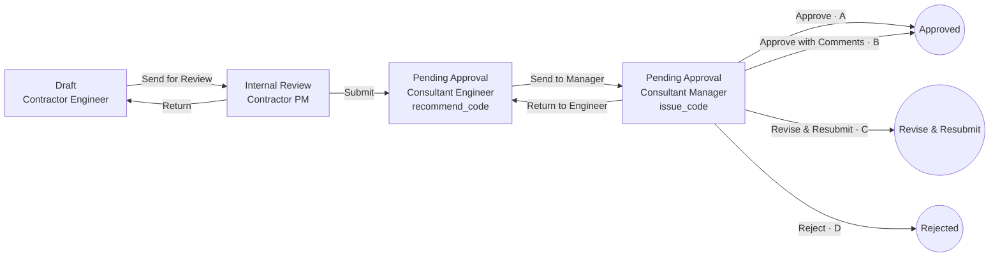

# Workflow engine design

How Work Items move through Workflows. Terms follow [GLOSSARY.md](../GLOSSARY.md); tables follow [data-model.md](data-model.md); every read and write obeys [visibility.md](visibility.md). The engine is built in-house on PostgreSQL ([ADR 0008](adr/0008-in-house-workflow-engine-on-postgres.md)).

The engine has two halves:
- **Definition time:** the visual builder, validation and publishing.
- **Run time:** one command, `take_transition`, plus a few supporting commands (§5), all executed as single database transactions.

---

## 1. Definition model

A Workflow version is a directed graph.

- **Steps** are the points of the graph. Each has:
  - a `stage_key`, which decides its Kanban column;
  - an **actor rule**: who may hold it (§3);
  - an `outcome_mode`: `none`, `recommend_code`, `issue_code` or `inspection_result`.

  There is no per-Step or per-Transition signing choice: every Transition is confirmed and recorded (§7, ADR 0017). The old `workflow_step.is_signing` column is read by nothing; the definition format (WF-2) and the builder leave it out.
- **Transitions** are edges. Each has:
  - a `label` (i18n);
  - a `kind`: `send` (within the Participant), `submit` (to another Participant), `return` (back within the Participant), `send_back` (back to the Participant that Submitted it, with no outcome; ADR 0014), `close` or `cancel`;
  - an optional `condition` (§4);
  - an optional `outcome` it sets: a closing outcome of the Work Item Type's outcome set ("Outcomes" below; the Rabaed Defaults' `A`, `B`, `C`, `D`, `passed`, `passed_with_comments`, `failed`, `approved`, `rejected`, `closed`);
  - an `action_form`: the pop-up schema;
  - `notifications`.
- **Start:** every Workflow has exactly one **Draft** Step (Stage category `draft`) where items are created.
- **End:** terminal Steps sit in Stages of category `closed_positive`, `closed_negative` or `cancelled`. Reaching one closes the item.

### Example: Rabaed Default "Material Submittal (MAR)"



The MAR has no Send Back: the Consultant sends work back to the Contractor only with Code C, and the Contractor resubmits it as a Revision (§5.4). Send Back is for Workflows such as the Site Report's "Return for Comment" (ADR 0014).

The Issued Code is the `outcome` of the Transition taken from the `issue_code` Step. The "Approve / B / C / D" buttons are four Transitions, each with its own Action Form. For example, B requires at least one comment row, and each row becomes a Comment Work Item.

### Definition format

As built (RP-425): one JSON document per Workflow Version, `WorkflowDefinition` in `packages/domain` (`workflow-definition.ts`), used by the builder (live), the api (publish) and Rabaed Admin (import):

- `steps`: `key`, `name` (English and Arabic), `stage` (the Stage key), `actor` (`role`, the Function Permission `permission`, optional `positions`; null on a terminal Step), `outcomeMode` (`none`, `recommend_code`, `issue_outcome`: the Issued Code or the Inspection Result, by the Work Item Type's `outcome_kind`).
- `transitions`: `key`, `label`, `kind`, `from`, `to`, `outcome`, `permission`, `actionForm`, and optionally:
  - `rules.restrict`: a condition; Positions; not the same person as held a Step (`step`) or took a Transition (`transition`); has been through a Step (`step`, one of the acting Participant's own) or a shared fact (`fact`: `sent_back`, `revision`); all Comments or Subtasks closed;
  - `rules.validate`: a condition with its message; Form complete; a Document (`has_document`, optionally in a named Document field);
  - `actions`: offer "Assign to" (the actor picks among their own Participant's Members; nothing is stored), set a field to a value or to the moment taken (`{ "now": true }`, never the text "now"), copy a field;
  - `notifications`: the holder or Step Pool, the raiser, watchers, a Position of the acting Participant.

  WF-7, WF-8 and WF-9 give them meaning at run time. As built (RP-430, WF-7): `rules` is stored in `workflow_transition.rules` and applied by `take_transition` (§4, §5.1). As built (RP-431, WF-8): `actions` is stored in `workflow_transition.actions` and applied by `take_transition` (§3.3, §5.1 "Actions").
- `layout`: Step positions on the builder's canvas, by Step key.

Stages are not in the definition: a Step names its Stage by key, and the Stages (with their categories) come from the Project and Module the Workflow runs in (the checks' `stages`).

**Stages** (as built, RP-428, WF-5): per Project and Module, seeded from the Rabaed Defaults; the Project Admin renames, adds, reorders and deletes them, each with a category (`draft`, `in_progress` (Open), `closed_positive`, `closed_negative`, `cancelled`) that never changes once added; a Stage is deleted only when no Step of any Workflow Version of the Project uses it (data-model.md `stage`). Kanban columns, List Stage chips, Dashboard buckets and "is the item closed" read the Project's Stages and their categories, never fixed keys. Publishing checks a Workflow against the Stage set of its owner: the Project's for a Project's Workflow; the Rabaed Defaults' for a Rabaed Default or a Library Workflow (seam-1 `workflow-definition.test.ts` picks the set the same way). Copying a Workflow into a Project maps its Stages by key and is refused when the Project's Module lacks one: `stageCopyProblems` (`packages/domain` `stage.ts`), one `stage_missing` problem per Stage with an English and Arabic message naming it and a Step in it. The copy command (`POST /v1/workflows/:id/duplicate`, `duplicateWorkflow` in the api) runs it on the copy into a Project, against that Project's Stages of the Workflow's Type's Module, in the transaction that copies: refused `stage_missing` (422) with `problems`, and nothing is copied. A copy into a Company Library has no Project Stages to check.

**Outcomes** (as built, RP-429, WF-6; glossary Outcome; data-model.md `outcome`): each Work Item Type has its own ordered outcome set: a code, an English and Arabic name, closing or not, positive or negative, and follow-up actions: create items from the closing Transition's Action Form rows, of a named Type (`create_items`, read by WF-11), offer the raiser a Revision (`offer_revision`, §5.4) or a replacement (`offer_replacement`, §5.5, WF-12). The Rabaed Defaults: Review Codes A, B (create Comments, Type `CMT`), C (offer a Revision), D (offer a replacement); Inspection Results Passed, Passed with Comments, Failed; Approval Approved, Rejected; None: Closed (`defaultOutcomeSets` in `@rabaed/domain` `outcome.ts`, `app.default_outcomes`). A Type starts with the set of its `outcome_kind`; every Project runs its own copy of each Rabaed Default Type's set, seeded as its Stages are. A Project Admin adds outcomes to the Project's copy and changes their names, follow-up actions and order (each audited in `project_event`); Rabaed Defaults never change in place. An outcome's code, closing and polarity change only while it is unused (decided 2026-10-09): no closing Transition of a published Workflow Version the Project's items can run names it (`app.outcome_in_use`, read from definitions only so the answer never depends on hidden items); once used they stay, refused `outcome_in_use` (409, with an English and Arabic message). Everyone who reads the Type reads its outcomes; nothing else widens. The Dashboard, the Kanban badges, the List's outcome filter and the Code C line read an outcome's place in its Type's set (closing, polarity, follow-up actions), never fixed codes: a card's bars are the Type's closing outcomes when it has two or more (those offering a Revision first, then the positive, then the negative; `dashboardBarOutcomes`), else Approved and Rejected by Stage; the Approved % counts the positive bars; the Code C line counts chains that had an outcome offering a Revision, "approved on revision" when the latest got a positive outcome, "rejected after C" a negative one offering no Revision (`chainBucket`, `codeCState`). An outcome's Dashboard bar and badge carry its English and Arabic name (`outcomeLabel`: "Approved (A)").

**Positions only.** No Workflow names a person, whoever owns it: a Rabaed Default is copied into other Companies' Projects, and every Project Workflow is read project-wide (ADR 0016). The format enforces it: an actor rule, an action and a notification have no field that holds a Member, and the one way left (setting a Member field to a value) is refused at publish (`names_person`).

`parseWorkflowDefinition` refuses unknown keys at any depth. `definitionFromRows` / `definitionToRows` convert a Version's rows (`workflow_step`, `workflow_transition` with Steps by key, `workflow_version.layout`) without loss: `is_signing` is always written false (ADR 0017); `rules` (RP-430), `actions` (RP-431) and `notifications` (RP-432) are columns, null when a Transition has none; a row carries each only when the definition has it.

### Publish-time validation

A draft Workflow version can't be published unless all of these hold. `workflowPublishProblems(definition, context)` in `packages/domain` (`workflow-checks.ts`, RP-425) runs every one of them, given the Type's `outcome_kind`, the Module's Stages and the Type's latest published Form; each problem has a stable code, the Step or Transition it concerns, its severity (`error`, or `warning`) and an English and Arabic message for the builder. The authoring commands (WF-4, RP-427) run it before every publish; Versions published as data by migration skipped it, so seam-1 `workflow-definition.test.ts` runs it on every published Version, and the rows' round trip with it.

1. Exactly one Draft start Step. Every Step is reachable from it, and every non-terminal Step has an outgoing Transition and an actor rule. `workflow-checks.ts` (with key uniqueness and Transitions naming existing Steps).
2. Every `stage_key` exists in the Module's Stage set, and terminal Steps sit in closed or cancelled Stages: nothing leaves a Step in a closed or cancelled Stage. `workflow-checks.ts`.
3. The Work Item Type's outcome set matches: every Transition into a terminal Step is a close (or a Cancel) and sets a closing outcome of the Type's set, and no other Transition sets one; when the set offers a choice (two or more closing outcomes), some Step issues the outcome and every such close leaves from a Step that issues it. As built (RP-429): the checks' context gives the set (`outcomes`): the Project's copy for a Project's own Workflow, the Rabaed Default set for a Rabaed Default or Library one (seam-1 `workflow-definition.test.ts` picks it the same way). `definitionToRows` keeps the outcome kind only to name a row's `outcome_mode` word. At run time trigger `work_item_outcome_in_set` refuses any item outcome that isn't a closing outcome of its Type's set on its Project (or `cancelled`). As built (RP-434): a close setting an outcome whose follow-up actions create items (`create_items`, Code B) needs its Action Form's `items_to_create` table with a text column (`items_table_missing`, naming the Type); whether a row is required is the Workflow's choice. `workflow-checks.ts`.
4. A `return` goes only to an earlier Step held by the **same** Participant role. A `submit` always crosses to a different role. A `send_back` goes from a Step of the role the item was Submitted to, back to a Step of the role that Submitted it, which the Workflow chooses; it sets no outcome. `workflowKindProblems` (`workflow-publish.ts`, RP-334).
5. ~~Every `submit` Transition and every Transition from an `issue_code` Step is signing.~~ Dropped by ADR 0017: every Transition is confirmed and recorded.
6. Conditions reference only fields that exist in the Form (checked against the Form's latest published version). Conditions read the Form and item attributes (`workflowRuleAttrs`: `trade`, `location`, `work_item_type`, `revision_no`); a Validate also reads the Transition's Action Form answers. A Restrict reads Action Form answers (WF-7) only where it picks among Transitions sharing a label and source Step, once the pop-up is filled, and then only fields every one of their Action Forms asks; a Restrict that hides a button is read before any pop-up. Actions write only fields the acting Participant fills at that Step (WF-8): the Transition's Action Form and the Form Sections changed at its source Step (`sectionSteps`); a copy reads only from those, never another Participant's answers (`field_not_filled_at_step`), and on a move inside one Participant (`send`, `return`) never from its Action Form into the Form (`copy_internal_answer`: those answers are Internal Communication, V5, such as a Recommended Code, and the Form is read by every Participant once the item leaves); "now" goes only into a date or time field. The Steps and Transitions a rule names exist, "has been through" a Step names one of the acting Participant's own, and a Document rule names a Document field (`attachments`, `photos`). `workflow-checks.ts`.
7. Action Forms are valid Form schemas. `workflowActionFormProblems` (`action-form.ts`, RP-300).
8. No cycle is possible without a `return` or a `send_back`. A loop across Participants always goes through a `send_back`, never through Submit alone. `workflowKindProblems` (`workflow-publish.ts`, RP-334).

And, from spec RP-423 (`workflow-checks.ts`):

- No Workflow names a person: Positions only. The format enforces it (see "Definition format"); an action setting a Member field to a value is `names_person`.
- A Cancel leaves only the raiser's own Steps (the Draft Step's role), goes to a Step in a cancelled Stage, and sets no outcome. At run time it is offered only until the first Submit, and never on a Revision (§5.1 "Cancel", §5.4).
- Among Transitions sharing a label and source Step, conditions that can overlap or leave a gap are a **warning** (§4): `condition_overlap`, `condition_gap`, found by trying the answers on each condition's edges.

As built (RP-334): checks 4 and 8 are `workflowKindProblems`, which `workflowPublishProblems` runs. A Step's role is its actor rule's `base_role`; a `send_back` is valid from a Step of role A to a Step of role B when some `submit` goes from a Step of B to a Step of A. The database also refuses a `send_back` with an outcome (`workflow_transition_send_back_no_outcome`), and `take_transition` raises on a `return` that would cross Participants. The seam suites' test Workflow with a Send Back is `addTestWorkflow` (`packages/db/test-support`).

Published versions never change. As built (RP-424): triggers `workflow_version_published_frozen`, `workflow_step_published_frozen` and `workflow_transition_published_frozen` refuse any UPDATE or DELETE of a published `workflow_version`, and any INSERT, UPDATE or DELETE of the `workflow_step` / `workflow_transition` rows of one (moved in or out included), even for the table owner (error 42501, as `form_version`'s guard); a draft stays editable and can be published. Seam-2 `workflow-version-frozen.test.ts`. Publishing v2 leaves v1 items untouched. Items on v1 show a notice ("Workflow updated to v2"), and anyone can view v2.

### Ownership and binding (ADR 0016)

A Workflow definition belongs to Rabaed (a **Rabaed Default**), to a Project (its own copy) or to a Company's **Library** (`workflow_definition.owner_kind` `rabaed`, `project` or `company`, with `project_id` or `company_id`). A copy keeps no link to the Workflow it was copied from.

A Project chooses the Workflow of each Work Item Type with a **binding** (`workflow_binding`): (Project, Type) → Workflow, and optionally exceptions (Project, Type, raising Participant) → Workflow, such as "Contractor X's DARs". At most one of each. A binding names one of the Project's own Workflows or a Rabaed Default with a published Version, never another Project's or a Library's (copied into the Project first).

A new item starts on the latest published Version of: the raiser's Participant's exception, else the Project's binding, else the Type's Rabaed Default; and keeps it (§2). Binding another Workflow, or publishing a new Version, reaches only items created afterwards.

Every Project Member reads the Project's Workflows whole, with every Company's Steps; a Library only its Company (visibility.md V20, V18). The item read gives its Workflow's name and Version number (`workflow` in the item detail).

As built (RP-426): `app.new_item_workflow_version(project, type, participant)` resolves the Version, for `app.create_work_item` and for the api's new-item Form (which Form Sections are editable at that Workflow's Draft). The trigger `workflow_binding_checked` refuses a binding outside these rules (error 23514). Bindings are written by WF-4's commands (RP-427, "Authoring" below). A Revision starts on its chain's own Workflow, not the binding's (`app.revision_draft_step`, §5.4). `app.is_draft_step` reads a Step's Stage without the Type whose default its Workflow is (a Project's own Workflow is no Type's default); a Stage key of category `draft` is a Draft in each Module that has it, in the Stage set the Workflow is published against (RP-428: its Project's for a Project's own Workflow, the Rabaed Defaults' for any other). It is the one definition of a Draft Step: `app.create_work_item` starts a new item at the Step it names, and the api's Form-at-a-Step reads the same rule (RP-448 review). The item read takes the Workflow's name and Version from `app.work_item_workflow` (security definer, for whoever sees the item), so it never hides an item from a viewer who can't read the Workflow's rows.

### Authoring (WF-4)

As built (RP-427, `20261226000000_workflow_authoring.sql`): the commands, each one transaction, each audited. The app role writes no definition table directly (seam 2 `workflow-authoring-rls.test.ts`).

- **Who may:** a Project's own Workflows and its bindings, its Project Admins; a Library Workflow, its Company's Authorized Person (no Position permission for it yet); a Rabaed Default, Rabaed Engineers in Rabaed Admin (with a reason, in `admin_action`: `save_workflow_draft`, `publish_workflow`) and the `pnpm workflow:publish --type <code> --definition <file.json> --reason <why> --engineer <email>` CLI (the migrator, as `form:publish`, writing the same `admin_action` row as Rabaed Admin: the active Engineer `--engineer` names, since the CLI signs nobody in). Anyone else gets `not_found`, the plain 404 (visibility.md scenario RP-427-1). A Member's command writes a `workflow_event` (who, when, what), read by nobody through the app role.
- **A Workflow is for one Work Item Type:** `workflow_definition.work_item_type_id` (backfilled from the Types and bindings), copied with it; `app.workflow_type` is the one rule for reading it (its own, else the Type whose Rabaed Default it is, else the first binding's), for the commands and the publish checks alike. Its publish checks run in that Type's context: its `outcome_kind` and outcome set (RP-429: the Project's copy for a Project's own Workflow, else the Rabaed Default set), the Stages of its Module (the Project's own when it has them, else the Rabaed Defaults'), its latest published Form, the Option Lists (`readWorkflowCheckContext`, `packages/db/src/workflow-authoring.ts`). Every save, check and publish, in the api and Rabaed Admin, runs one sequence on a document (`prepareDraft`: parse, publish checks); a Transition's rules, actions and notifications (WF-7 to WF-9) are saved, read and copied with it (`app.store_workflow_draft`, `app.workflow_version_rows`).
- **Duplicate** (`app.duplicate_workflow(source, project, name, now)`, `POST /v1/workflows/:id/duplicate {projectId, name}`): copies the latest published Version of a Workflow the Member reads (a Rabaed Default, a Workflow of a Project they are on, their Library's) as draft Version 1 of a new Workflow of the Project (`projectId`) or of their Company's Library (`projectId: null`). Copy to Library and copy from Library into a Project are this command. Nothing records the original (ADR 0016). Refusals: `not_found`; `project_closed` (409); `invalid_name` (422, a name that isn't English and Arabic).
- **Read** (`GET /v1/workflows/:id`, `WorkflowRead`): the published Versions and the latest one's definition, for whoever reads the Workflow (V18, V20); its draft, with the name it publishes under, only for its authors (`app.workflow_draft`). A Workflow with no published Version yet is read by its authors only: anyone else gets the plain 404 (row-level security on `workflow_definition`, scenario RP-427-5).
- **Save draft** (`app.save_workflow_draft`, `PUT /v1/workflows/:id/draft {name?, definition}`): the definition document, parsed by `parseWorkflowDefinition` (refused `invalid_definition`, 422, with each issue's path), written as the draft Version's rows (`definitionToRows`; a new draft Version after the latest when there is none). A Transition's `rules`, `actions` and `notifications` are saved in their columns (WF-7, WF-8, WF-9). A new `name` waits with the draft (`workflow_version.draft_name`) and becomes the Workflow's name when it is published: until then Members and items read the published name (V20, scenario RP-427-5). Refusals besides: `not_found`; `project_closed` (409); `invalid_name` (422).
- **Validate** (`POST /v1/workflows/:id/validate {definition?}`): `{ issues, problems }` for the given document, or the saved draft; saves nothing.
- **Publish** (`app.publish_workflow`, `POST /v1/workflows/:id/publish`): the api reads the draft through `app.workflow_draft`, which locks the definition, runs `workflowPublishProblems` on it and calls the command in the same transaction, so no save comes between. Any error refuses it (`workflow_problems`, 422, with every problem); warnings are returned with the new `versionNo`. The Workflow takes the draft's name. Nothing to publish is `no_draft` (409); `not_found`; `project_closed` (409).
- **Bind / unbind** (`app.bind_workflow`, `app.unbind_workflow`, `PUT` / `DELETE /v1/projects/:id/workflow-bindings`): a Project Admin binds a Type the Project uses, for every raiser or for one raising Participant, to the Project's own Workflow or a Rabaed Default (another Project's, a Library's and a made-up one are all `not_found`); `workflow_not_published` (409) and `workflow_not_for_type` (422) otherwise, and `project_closed` (409) on a closed Project, for both. Unbinding goes back to the Project's binding, else the Rabaed Default. Both reach new items only.
- **An exception's Workflow names no Participant** (visibility.md V20): binding it as an exception, publishing it while it is one (under its draft's name), and saving a draft renaming it while it is one are refused `workflow_name_names_participant` (422) when the name (English or Arabic) holds a Participant's Company legal name or its Participant Code as a whole word (`app.names_participant`).
- Rabaed Admin's and the CLI's functions, granted to `rabaed_admin` only and refusing any Workflow but a Rabaed Default (`not_found`): `app.write_workflow_draft`, `app.mark_workflow_published`. The commands above and they share the uncallable cores `app.store_workflow_draft` and `app.publish_workflow_draft`; a Version's rows are shaped once, by `app.workflow_version_rows` (security invoker). Rabaed Admin's routes: `POST /v1/workflows/:typeCode/validate`, `/draft` and `/publish` (`{definition, reason}`).

---

## 2. Run-time state

The state lives on `work_item`:
- `current_step_id`, `current_stage_key`, `step_entered_at` (for Step Age);
- `participant_entered_at`, `participant_entered_step_id`: when, and at which Step, it reached the holding Participant (§10);
- `outcome`, `closed_at`.

The current holder is the single open `step_assignment` row.

History is the append-only `work_item_event` chain. Every command appends exactly one or more events with `prev_hash → hash`.

---

## 3. Who holds a Step (actor resolution)

When an item enters a Step, the engine resolves the holder in three stages.

**3.1 Participant.** The actor rule names a base or Project Role, for example "Consultant".
- If the role is the raiser's own role, the Participant is the raiser.
- Otherwise the candidates are active Participants in that role whose Visibility covers **all** the item's dimension values (Trade, Location…):
  - **1 candidate:** chosen.
  - **More than 1:** the person taking the Submit picks one in the Action Form. Project Settings also shows a **Visibility Overlap** warning, since this usually means misconfiguration.
  - **A Send Back** goes back to the Participant that held its target Step before (it Submitted the item from there), never to another of its role (V3; as built, RP-434, `app.next_step_holder`): a Comment Returned to Open reaches the Contractor that resolved it. With no earlier holder, the rule above applies.
  - **0 candidates:** a Visibility Gap. The Transition isn't offered, and taking it is refused with the same answer as for more than one candidate or an empty Step Pool (§3.2): `next_step_unavailable`, shown as "This can't be handed over yet: the next step has nobody to take it. Ask a Project Admin." The answer never says which case it is, nor names another Participant, Trade or Location (visibility.md, "Refusals of a Transition"; V14, V16). Separately, Project Admins get a Visibility Gap warning, computed from Participant grants only (V16).

**3.2 Step Pool.** The pool is the active Project Members of that Participant who:
- hold a Position with the rule's required permission (e.g. `review`, `approve`) for this Work Item Type, and
- have Visibility covering the item.

**3.3 Default assignee.** The first rule that yields a pool member wins:
1. The person who held this Step before, when coming back by `return` or `send_back`.
2. A person the previous actor picked in the Action Form, if the Transition offers "Assign to". As built (RP-431, WF-8): only a Member of the actor's own Participant, from the next Step's Step Pool (Positions, Visibility), so only when that Participant holds the next Step; never another Company's Members (`app.assignees_offered`). The pick is `take_transition`'s `p_assign_to`; one it couldn't have offered is refused `assignee_not_offered`, whoever it names.
3. The Participant's **default holder** for this Step, set in Project Settings by that Participant (e.g. "Contractor PM: Ali").
4. Otherwise the item stays **pooled**. Everyone in the pool sees it under "Need My Action", and one of them **claims** it.

---

## 4. Conditions (routing)

A condition is a small JSON rule over three sources: the item's Form data, the current Action Form answers, and item attributes (Trade, Location, Work Item Type). Example:

```json
{ "all": [ { "field": "cost_impact", "op": ">", "value": 500000 },
           { "attr": "trade", "op": "in", "value": ["EL", "ME"] } ] }
```

- Operators: `= != > >= < <= in not_in empty not_empty`, plus `all`, `any` and `not`. There is no code and no scripting.
- When several Transitions share a label and source Step, exactly one must match at run time. Publish validation warns when conditions can overlap or leave a gap. If none matches at run time, the action is blocked with a clear message.

### As built (RP-430, WF-7): Restrict and Validate at run time

- **One rule, two layers.** `evaluateCondition` (`@rabaed/domain` `condition.ts`) and `app.condition_holds(rule, fields, action_form_answers, attrs)` are the same rule, run over the same cases (`condition-cases.json`; unit and seam-2 tests). A `field` reads the Action Form answer when the Action Form has that key, else the Form's; an `attr` reads `trade` and `location` (their codes), `work_item_type` (its code) and `revision_no` (`app.work_item_rule_attrs`).
- **What a rule reads is what the acting Member may read**, so a refusal never differs by hidden data: the answers through `app.work_item_answers` (ADR 0012); "not the same person" and "has been through" only the item's events shared with every Participant or internal to the acting one (V5); "has been through" a Step only a Step the acting Participant held (`step_assignment`), never another Participant's internal route, even where its shared Submit left that Step (V14); "all Comments closed" only Comments the Member sees (`app.sees_work_item`), naming none; "a Document" only Documents the Member sees (`app.item_row_seen`). Visibility scenarios RP-430-1 to RP-430-3.
- **Restrict** (`app.transition_conditions_hold`, `app.transition_restrictions_hold`): a condition; Positions (the acting Member holds one of them); not the Member who left a Step or took a Transition (their own events of the item); has been through a Step, or a shared fact (`sent_back`: a Send Back event; `revision`: `revision_no > 0`); all Comments closed (open items linked `raised_from` to it). Subtasks don't exist yet (no `work_item.parent_id`): "all Subtasks closed" holds until they do. A Transition whose Restrict doesn't hold isn't offered (`app.takeable_transitions`), and taking it is refused `transition_not_available`, exactly like a key that isn't there.
- **Not the same person removes that Member from the Step Pool for the Transition** (RP-449 review): the Members it names (`app.not_same_person_members`, read as the Restrict reads them) neither take it nor become its next holder. The next Step's pool for it is `app.transition_step_pool` (the Step Pool without them): `app.next_step_holder` asks for someone in it, so when nobody is left the Transition isn't offered and is refused with the usual uniform answer (`next_step_unavailable`, or `no_step_pool` at the raiser's own Steps, §3.2); "Assign to" (`app.assignees_offered`) offers only it; coming back by a Return or a Send Back goes to the previous holder only when they are in it, else to the pool. The pooled assignment it makes stays without them until claimed: `app.step_pool` reads the Transition that made a pooled assignment (its event, at the assignment's time) and leaves its named Members out, so they can't claim it, aren't offered the claim and aren't told it waits.
- **One button per label.** Transitions sharing a label and source Step are offered once (the first by sort, whose other Restrict rules hold); taking any of their keys takes the one whose conditions hold with the Form, the attributes and the Action Form answers (`app.transition_routed`). None or several: `no_route` ("This can't go ahead: its answers match no route, or more than one."). A Transition with no label to share is offered only when its conditions hold before any pop-up.
- **Validate** (`app.transition_validation_failed`): a condition with its message, at least one Document (on the item, or in the named field). Taking it is refused `validation_failed` (422) with the rule's message in English and Arabic (`validationMessage` in `@rabaed/domain`); the database answers `validation_failed:<n>`, the rule's place in `validate`, and the API gives its message. **The Form complete** is the Form engine's completeness (`validateAnswers`, with conditional required, tables, checklists and files), so the API checks it, over the whole Form as the Member reads it, before calling `take_transition`, as it checks the sections a Step leaves; the database doesn't. Why not in SQL: completeness is the Form engine's one definition (TypeScript `validateAnswers`: conditional required, tables, checklists, file counts, Option Lists); a second copy in SQL would be a second definition of the same rule that could drift, against CODING_STANDARDS (one definition per layer, both tested over the same cases), and nothing in it needs the database's locks. The database still holds the API to it: `take_transition` takes the hash of the answers the API checked (`p_checked_data_sha256`) and refuses `form_not_checked` when the locked item's answers differ, so no answers the API did not find complete move on.
- **`take_transition` is short** (RP-449 review, CODING_STANDARDS: a function redefined again gets its copied block extracted first): its checks in order, then `app.transition_next_holder` (the next holder: the Participant, the previous holder coming back, the "Assign to" pick), the Recommended Code check, the actions step, and `app.transition_effects` (everything it writes). `app.takeable_transitions`, `app.transition_assignees` and `app.transition_recommendable_outcomes` read the item the acting Member holds through `app.held_work_item`; "a Cancel only until Submitted" is `app.cancel_allowed`, used where it is offered and where it is taken. A later ticket redefines the short body or a helper, never a copy of the whole.
- **The rules step** is `app.transition_rules(item, transition, answers)`: route, Restrict, Validate, returning the Transition to take and the refusal. `take_transition` calls it once the Transition is found and goes on with the routed one; a later redefinition (WF-8) keeps the call. The API asks `app.transition_route` for the routed Transition first, to check its Action Form and "Form complete".

---

## 5. Commands

Every command runs in **one transaction**:
- it locks the item row (`SELECT … FOR UPDATE`);
- it takes an **idempotency key**, so a double-click can't apply twice;
- it writes side effects (notifications, PDF jobs, emails) to an **outbox** table in the same transaction, and workers deliver them afterwards.

### 5.1 `take_transition(item, transition, action_form_answers, confirmed)`

Checks, in order. Any failure aborts with nothing written.

1. The item is open, the Project is Active, and the caller is an active Project Member who can see the item (visibility layers 2–4).
2. The caller holds the current assignment (claimed, or default-assigned).
3. The Transition starts from the current Step on the item's **pinned** Workflow version, and its condition matches. As built (RP-430): its rules (§4, "Restrict and Validate at run time"): the route among Transitions sharing its label (`no_route`), its Restrict (`transition_not_available`) and its Validate (`validation_failed`).
4. The caller holds the permission the Transition needs.
5. The Action Form answers validate. With Code B, there is at least one comment.
6. **Confirmed** (ADR 0017): every Transition carries `confirmed = true` from its confirmation pop-up. As built (RP-436): the api's `takeTransitionRequest.confirmed`; without it, an item the caller sees is refused `not_confirmed` (422), a hidden one is the plain 404, and nothing is written. A Member also needs a saved Signature (`member_signature`) before taking any Transition; that check comes with the Signature itself (RP-85) and is not enforced yet.
7. **On `submit`:**
   - all Form-required fields are complete;
   - for a Revision of a drawing submittal, every carried Markup has a reply.
8. Actor resolution for the target Step succeeds (§3).

Effects, in order:

1. **First exit from Draft:**
   - the Document Number is assigned (§8), and `numbered_at` (the Creation Date) set with it;
   - all Documents are frozen (`frozen_at`, content hashed).
2. The event is appended. It records:
   - type `transition` (or `recommend_code` / `issue_code`);
   - the Action Form payload;
   - `audience`: `shared` if the Transition is `submit` or `send_back`, closes the item, or comes from an `issue_code` Step; otherwise `internal` to the actor's Participant;
   - who took it (`actor_member_id`, `actor_participant_id`) and when (`created_at`);
   - `signature_id`, the Member's saved Signature version, once RP-85 builds it;
   - a `content_sha256` of the item's exact content as the Transition leaves it (§7);
   - the hash chain.

   An Internal Note written in the Action Form is its own `internal_note` event, appended just before the Transition's, carrying the Transition's id. It is always `internal` to the actor's Participant, even with a Submit or a Code (visibility.md V5).
3. The current assignment is closed (`done`).
4. The item moves: `current_step_id`, `current_stage_key` and `step_entered_at` are set. If it leaves the acting Participant (handed to another, or closed), `participant_entered_at` and `participant_entered_step_id` are set too. The event is `shared` when the item leaves the acting Participant (a Submit or a close always does); a move inside one Participant is `internal`, even from a Step that issues Codes.
5. **If the new Step is non-terminal:** a new assignment is created (§3), and `work_item_access` is granted to the holder's Participant (`handling`). On the first `submit`, oversight access is granted to Owner and Owner Representative Participants whose Visibility covers the item, and `submitted_at` (the Submission Date) is set when the raiser's Participant takes it; a later Submit, after a Send Back, leaves it. While a Sent Back item is at its raiser's Steps, everyone with access still sees it, as it was at the Send Back (visibility.md V1, V19; RP-309). Every move to another Participant, and every close, adds one to `work_item.arrivals`, which marks what the next holder adds as its own until the item leaves it.
   A `send_back` out of a Step of a Participant other than the raiser first puts the Form Sections other Participants fill back as they arrived (ADR 0013), and needs no complete Form.
6. **If the new Step is terminal:**
   - `outcome` and `closed_at` are set;
   - outcome hooks run (§6);
   - a Documental Record job is written to the outbox (§7);
   - the Package status is recomputed;
   - the parent is re-checked (a parent can't close while Subtasks are open, so that check is also a precondition when the parent itself closes);
   - **follow-up items** (as built, RP-434, WF-11): when the outcome's follow-up actions create items (`create_items`, Code B's Comments), `app.transition_follow_up_items` makes one item of that Type per row of the Action Form's `items_to_create` table, in the same transaction, after the effects above (§6).
7. Notifications for the Transition go to the outbox. Recipients are re-checked against visibility at send time.
   - **Step reached** (RP-195): a trigger on the new open `step_assignment`; delivered to its holder or Step Pool, never the actor.
   - **Watched items** (RP-355): a trigger on `work_item_event` (a Transition, a Code or Inspection Result, a new Revision, a cancel; never `answers_changed`, Documents, claims, Recommended Codes or Internal Notes) writes a row when someone other than the actor watches the chain. `app.deliver_notification` delivers it to the chain's watchers who still see the item (`app.work_item_watchers`) and may read the event (V5: an internal move reaches only its own Participant), except the actor and the Members the event made it wait on (they get "Step reached").
   - **Sent Back** (RP-356): a trigger on a `send_back` Transition's event writes a row; it is delivered to the active Project Members of the Participant it was sent back to (the Participant of the Step it gave back) who still see the item, never the actor, routed by their "Sent Back" settings. For them it is the one notification of that move: no "Step reached" for that Step and no watched-item notification of it. Nothing for a closed Project.
   - **Routing** (RP-355): every recipient's notification passes the routing rule (`app.notification_route`, the same as `@rabaed/domain`'s `routeNotification`) with their settings, Project mute and email pause: in-app (always yes, but for a muted Project and the weekly report; RP-432) and email none/immediate/digest, stored on the notification for the email jobs. A notification for neither is not written. Need My Action never passes through it. The weekly Step Age report is an email only: its route has no bell and, while its email is on, `immediate` (sent on its schedule).
   - **Immediate email** (RP-357): a notification routed `immediate` writes an `email` outbox row; the worker sends it in the recipient's preferred language (else their locale), with one template per kind (`notificationEmailTemplate` in `@rabaed/mailer`), only if `app.take_notification_email` finds it may still go (see data-model.md, notification). A failed send is retried and dead-lettered like any outbox row.
   - **Daily digest** (RP-358): a notification routed `digest` waits. The worker's scheduled job `daily_digest` (07:00 Asia/Riyadh, Sunday to Thursday: `dailyDigestSchedule` in `@rabaed/domain`; a run missed while the worker was down is made up within 12 hours, never the next day) writes one `digest` outbox row per Member with notifications waiting, and the worker sends each Member one email, grouped by Project, then item, in their language (template `daily-digest`). Each entry passes the immediate email's send-time checks; one that fails is dropped. Friday's and Saturday's wait for Sunday's; an empty digest is not sent.
   - **Closed Project** (RP-360, visibility.md scenario 15): a Project that is no longer active goes quiet. `app.deliver_notification` delivers nothing of it (events still in the outbox when it closed reach nobody), no digest is queued for what waits on it, and immediate emails, digest entries and weekly reports check it again at send time. Notifications already delivered stay in the bell.

**Actions** (as built, RP-431, WF-8). After the rules step and every check above, before any effect, in the same transaction:

- **"Assign to"** (`offer_assign_to`): the pop-up offers the next Step's Step Pool when the acting Participant holds that Step (`app.assignees_offered`; the API reads it through `app.transition_assignees` as `WorkItemActions.transitions[].assignTo`, with names, the viewer's own Company only), and nobody otherwise. The picked Member holds the new assignment, claimed (§3.3 rule 2, after the holder coming back by a Return or a Send Back), so it is in their Need My Action. Any other pick: `assignee_not_offered` (422), nothing written.
- **Set and copy** (`app.transition_actions`, the actions step, kept apart so later redefinitions call it unchanged): a write goes into the Action Form answers when the Action Form has that key, else into the Form; only into what the acting Participant fills at this Step (its Action Form's fields, and the Form Sections it may change now, `app.editable_section_keys`; never a calculated or Built-in Field). A copy reads only from those fields, the Form as the actor reads it (`app.work_item_answers`), so never another Participant's answers, and on a `send` or `return` never an Action Form answer into the Form (V5). "Now" (`app.moment_answer`) is the moment taken: a `date` or `time` in Riyadh, a `datetime` in UTC. Anything else, whatever the reason, is refused `action_not_allowed` (409) with nothing written; publishing refuses each case first (§1, check 6). Actions run in order, a copy reading what an earlier one wrote.
- Form writes are saved as Save draft saves them, through the one helper both call (`app.write_work_item_answers`): the answers as they arrived kept for everyone else (V19), field times, and once the item has left Draft an `answers_changed` event internal to the actor's Participant, just before the Transition's event, whose content hash covers them. Action Form writes are in the Transition event's payload.

**Cancel** (as built, RP-433, WF-10). A `cancel` Transition (publishing keeps it to the raiser's own Steps, into a Step in a cancelled Stage, with no outcome) is offered (`app.takeable_transitions`) and taken only until the item is first Submitted (`submitted_at`): after that it isn't there, even back at the raiser's Steps after a Send Back, and taking it is refused `transition_not_available` (one rule for both, `app.cancel_allowed`). **Cancel is discard for a Revision** (decided 2026-10-09): a Revision (`revision_no > 0`) is never offered a Cancel and can't take one, from its Draft or the raiser's other Steps; while it is a Draft its raiser discards it instead (§5.4), and the next Revision reuses its number, so a Revision chain never ends by Cancel. It needs no complete Form, closes the item with outcome `cancelled` (allowed outside every outcome set), and is recorded like any Transition: a `transition` event, `shared` (nobody outside the raiser's Participant sees an item before its first Submit). A Cancel issues no Document Number: a Draft cancelled keeps "No number yet"; one cancelled from Internal Review keeps the number it got leaving Draft. Open Subtasks are cancelled with it (§6) once Subtasks exist (no `work_item.parent_id` yet); Comments are raised only by a Code, so never before Submit. The Rabaed Default Stages of Submittals include **Cancelled** (category `cancelled`), copied into every Project. Seam 1 and 2: `cancel-recommended-code.test.ts`, `cancel-recommended-code-rls.test.ts` (the test Workflow's `withCancel`).

### 5.2 `claim(item)` / `release(item)`

- Claim takes a pooled assignment. It uses a conditional update, so only one claimer wins.
- Release returns it to the pool.
- Both append internal events.
- A claim withdraws the other pool Members' unread "Step reached" notification for that Step (RP-355, scenario 70: `app.withdraw_step_reached`, a trigger). A release doesn't bring it back.

### 5.3 `recommend_code(item, code, note)`

- Only on a `recommend_code` Step, usually as part of that Step's forward Transition Action Form.
- It is stored as an internal event, and `recommended_code` is updated.
- It is never visible outside the Participant.
- **As built (RP-433, WF-10; `20270103000000_cancel_recommended_code.sql`, `take_transition` in `20270105100000_cancel_take_transition.sql`):** part of `take_transition`, as `p_recommended_code` (the api's `recommendedCode`); its note is the Internal Note written with it. Offered only on a `send` from a Step whose outcome mode is `recommend_code`, whose next Step the same Participant holds, and only the Type's closing outcomes on the item's Project, in order (`app.recommendable_outcomes`; for the api `app.transition_recommendable_outcomes`, as `WorkItemActions.transitions[].recommendCode`, with each outcome's name). Any other is refused `recommended_code_not_offered` (422), one answer whatever the reason, with nothing written. It is optional. It is its own `recommend_code` event (`payload.recommended_code`), always `internal` to the recommender's Participant, just before the Internal Note and the Transition; there is no `recommended_code` column, since every Participant that sees the item reads its row. So the history (`app.work_item_history`'s `recommended_code`, the api's `recommendedCode`), the Activity Feed and their numbering read it through the same RLS as any internal event, and no notification carries it (the watched-event trigger ignores it). Visibility scenario RP-433-1.

### 5.4 `create_revision(closed_item)`

- **Allowed when:** the item is the **latest** Revision of its chain, its outcome offers a Revision in its Type's set (Code C in the Rabaed Defaults; RP-429: `app.outcome_offers`; Inspection Revisions after `failed` are out of this scope; RP-311 review, `20261107000300_revision_code_c_only.sql`), no other Revision of the chain is open, and the caller may raise the item: an active Member of the raiser's Participant whom the Workflow's Draft Step actor rule allows (for the MAR, the Contractor's engineers). When the Workflow engine gains "assign to", the Workflow may name one person instead (settled 2026-10-05).
- **Creates** a new item:
  - `revision_of_id` = the closed item, `root_id` kept, `revision_no + 1`;
  - Form data copied, except Form Sections filled by other Participants, which start empty (form-engine.md §4); Documents copied as new unfrozen rows;
  - pinned to the **latest published** Form and Workflow versions, with a notice if they changed;
  - starts at Draft, showing "No number yet" like any new item;
  - gets the base Document Number with the revision suffix when it first leaves Draft (§8);
  - Drawing Markups carried over as open items needing replies (with drawing submittals, later).
- **Discard:** a Revision still in Draft can be discarded by the raiser's Participant. Nothing about it ever left that Participant, so the next Revision reuses its `revision_no`. Discard is how a Revision is given up: it is never offered a Cancel (decided 2026-10-09; `app.cancel_allowed`, §5.1 "Cancel"), so a chain never ends by Cancel.
- The closed item stays closed and gains a `related` Link to the new one.
- **The item page shows the chain:** a drop-down lists every Revision of the chain the viewer may see (V1 applies to each Revision on its own), and choosing one shows that Revision's answers, Documents and history. Reviewers decide on the latest Revision they received.
- **As built (RP-316, `20261105000000_create_revision.sql`):**
  - `work_item.revision_no`, `revision_of_id`, `root_id` (an original's own id, set on insert) and `discarded_at`; one `revision_no` per chain among the rows not discarded. The app role reads `revision_no` only, never the chain's ids (an Owner Representative whose Visibility widened may see Rev 1 but not the original, V2).
  - `app.can_create_revision(item)` is the rule above, with the Draft Step of the **latest** published Version of the Workflow the item runs (role and permission; `app.revision_draft_step`, RP-427). `app.create_revision(item, idempotency_key, now)` locks the chain's original row, so two requests never open two Revisions, and answers `created`, `applied` (the same key again: the same Revision), `not_found` (hidden), `project_closed`, `idempotency_key_reused`, or `revision_not_allowed` for every other reason alike: nobody outside the raiser learns whether a Draft Revision is open. The api is `POST /v1/work-items/:id/revisions` (409 `revision_not_allowed`).
  - The answers come from `app.fill_revision` (form-engine.md §4), only for fields the Revision's Form Version still has with the same type; `WorkItemDetail.versionsChanged` says when the Form or Workflow Version differs from the revised item's, and the page shows a notice. Documents are copied as new, confirmed, unfrozen rows keeping their original upload times (`document_copy` records the source, never granted; RP-393), and the api copies their files in the same transaction, since a storage key names its item.
  - **Discard** (`app.discard_revision`, `POST /v1/work-items/:id/discard`): only while the Revision has no Document Number (it never left Draft), by an active Member of the raiser's Participant. It closes as `cancelled`, is marked `discarded_at`, its assignment is done and its `work_item_access` rows go, so nobody, the raiser included, sees it again. Outcomes `discarded`, `not_found`, `project_closed`, `not_discardable` (409). A Revision Returned to Draft after it was numbered can't be discarded: its number was issued.
  - The `related` Link from the revised item is added at the Revision's **first Submit**, not at creation: the closed item's Links are read by everyone who sees it, and a Draft Revision must not reach them (V1, scenario 51).
  - `WorkItemDetail` has `revisionNo`, `versionsChanged`, `droppedFields` (form-engine.md §7, `app.revision_dropped_fields`), and `actions.createRevision` / `actions.discardRevision`.
  - Database functions: `app.revision_draft_step(item)` (the Draft Step of the latest published Version of the Workflow the item runs, RP-427: a chain stays on its own Workflow whatever the Project binds later; it replaced `app.latest_draft_step(type)`, the Type's Rabaed Default's, dropped in the same migration), `app.can_create_revision(item)`, `app.can_discard_revision(item)`, `app.revision_versions_changed(item)`, `app.revision_dropped_fields(item)`, `app.form_field_type(form_version, key)`, `app.create_revision(item, key, now)`, `app.fill_revision(revision, closed_item, now)` (only `app.create_revision` calls it), `app.revision_document_copies(item)` (the storage keys the api copies), `app.discard_revision(item, now)`, `app.revision_chain(item)` and `app.set_work_item_root()` (the trigger setting an original's `root_id`).
  - Error codes: `revision_not_allowed` (409, every reason alike), `not_discardable` (409), `project_closed` (409), `idempotency_key_reused` (409); a hidden or made-up item is the plain 404.
  - **Links follow the drop-down** (RP-311 review, settled with the user): a reader who sees one item of the chain but not another never reads the other through the Links, Linked from or a link answer, not even by number and Subject (form-engine.md §2.8a, visibility.md scenario 62).
- **The drop-down as built (RP-318, `20261106000000_revision_chain.sql`):** `app.revision_chain(item)` (security definer, the app role's only way to the chain) returns the Revisions of the item's chain the acting Member sees, `app.sees_work_item` checked on each, the original first, each with its id, Document Number (null until it first leaves Draft) and `revision_no`; never a discarded one, and nothing for an item the caller can't see. The api is `GET /v1/work-items/:id/revisions` (`RevisionChain`), a hidden item the plain 404. The item page shows `RevisionPicker` beside the Document Number only when the viewer sees more than one Revision. Each Document Number is shown whole, as issued, its " Rev n" included (stored in English), left to right in both languages, like every Document Number; a Draft Revision reads "Revision n: no number yet".

### 5.5 `replace_rejected(closed_item)` for Code D

This creates a **new** item with a new Document Number and a `replaces` Link to the rejected one. Rejected items never get Revisions.

- **Allowed when** (`app.can_create_replacement`): the item is closed with an outcome whose follow-up actions in its Type's set include `offer_replacement` (Code D in the Rabaed Defaults; never a fixed code, RP-429 `app.outcome_offers`), and the caller may raise the item, as for a Revision: an active Member of the raiser's Participant whom the Workflow's Draft Step actor rule allows. At most one replacement stands per item: another is refused while one exists that is neither discarded nor Cancelled.
- **Creates** a new Work Item (`app.create_replacement`, RP-435): not a Revision (`revision_no` 0, no `revision_of_id`, its own chain), with the source's Subject; the answers copied as for a Revision, except Form Sections filled by other Participants, which start empty (`app.fill_revision`, which now asks that the source's outcome offers a Revision or a replacement); Documents copied as new unfrozen rows; pinned to the latest published Form version and to the latest published Version of the Workflow a new item of its Type raised by its raiser runs (`app.new_item_workflow_version`, RP-426: the raiser's exception, else the Project's binding, else the Rabaed Default; not the source's), at its Draft Step; at Draft, "No number yet", and a new Document Number from the counter when it first leaves Draft (§8), no " Rev". It is visible like any new Draft: to the raiser's Participant only (V1).
- **The Link** runs from the replacement to the rejected item (`kind = replaces`) and is made at creation, so `app.take_transition` isn't involved. It is read under the replacement's row-level security: nobody else reads it while the replacement is a Draft; the replacement lists the rejected item under its Links (E1), and the rejected item lists the replacement in Linked from (E3) once it has been Submitted. It isn't a free Link: Links can't remove it.
- **The api** is `POST /v1/work-items/:id/replacements` (`{idempotencyKey}`, 201 `{id}`; 409 `replacement_not_allowed` for every refusal alike, 422 `idempotency_key_reused`, 404 for a hidden item); the same key again answers with the same replacement. `WorkItemDetail.actions.createReplacement` says when the item page offers its Create replacement card, beside the Create Revision card (`actions.createRevision`, the outcome's `offer_revision`); both read the outcome's follow-up actions. A replacement Draft is discarded like any new Draft, by the Workflow's own Cancel Transition when it has one.

### 5.6 Admin commands (Rabaed Admin only, `admin_action` + a shared event with a reason)

- `admin_reassign(item, member)`: moves the open assignment to another pool member.
- `admin_reset_step(item)`: re-creates the current Step's assignment and clears a stuck claim. The Step, Stage and outcome don't change.

There is no admin path to `take_transition`, `recommend_code`, `issue_code`, or changing the Workflow version.

---

## 6. Outcome hooks

As built (RP-429): what an outcome leads to is its follow-up actions in its Type's set (§1 "Outcomes"), never its code; the table gives the Rabaed Defaults. `app.work_item_outcome_actions(item)` gives a closed item's to whoever sees it: WF-11 builds B's Comments from `create_items`, D's replacement reads `offer_replacement` (§5.5, as built, RP-435: `app.can_create_replacement`), and Create Revision reads `offer_revision` (`app.can_create_revision`).

| Outcome | Effect |
|---|---|
| A | Approved. If the item is a supplier submittal, an Approved Supplier List entry is added. If it's a drawing submittal, its Drawing Revision becomes current and the previous one is superseded. |
| B | As for A, plus one **Comment** Work Item per comment row (and per open Markup, with drawing submittals). Each is `raised_from`-linked, assigned per the Comment type's Workflow. "All comments closed" is tracked on the source item. |
| C | Closed with a "Create Revision" action available to the raiser. |
| D | Closed with a "Create replacement" action (`offer_replacement`, §5.5). |
| passed / passed_with_comments | Like A / B, for Inspections. |
| failed | Like C: re-inspection by Revision. |
| cancelled | Closed. Open Subtasks are cancelled too (once Subtasks exist; RP-433: a Cancel is taken only before the first Submit, so no Comment exists yet). Only an original is cancelled: a Revision is discarded instead (§5.4). |

**Code B's Comments as built (RP-434, WF-11; `20270107000000_code_b_comments.sql`).**

- **The Comment Type** `CMT` (Snag List, outcome kind `none`: Closed) has a Form (the comment, an optional reference to a field or Document of the reviewed item, the Classification, and a Resolution section filled at Open) and the **Rabaed Default Comment Workflow**: Draft (Consultant) ─Raise (submit)→ Open (Contractor) ─Resolve (submit; the resolution note is required)→ Resolved (Consultant) ─Close→ Closed (`closed`), or ─Return to Open (Send Back, with a reason)→ Open. Version 1 is migrated as data; the same document is `apps/admin/workflows/CMT.json`, which `pnpm workflow:publish --type CMT` publishes as the next Version (seam 1 keeps the two equal). The Snag List's Rabaed Default Stages are Drafts, Open, Resolved and Closed; its Function Permissions give the Contractor's Positions `submit` (resolve) and the Consultant's `create` and `close`. Photos on a resolution wait for files outside Draft (Documents change in Draft only).
- **The rows** (`app.transition_follow_up_items`, called by `app.take_transition` once the item is closed): for an outcome with `create_items` of Type X, each row of the Action Form's `items_to_create` table becomes an item of X: raised by the acting Participant (the reviewer); on the Workflow a new item of X raised by it starts (`app.new_item_workflow_version`); already Raised, at the Step its Draft's single Submit leads to, pooled for the reviewed item's raiser (routed there, never by §3.1, so never another Contractor; V3); with the reviewed item's Trade, Location and Scopes; its answers the row's cells under the keys X's Form has; its Subject the row's first text cell (at most 200 characters); a Document Number from the counter (§8); `submitted_at` set (it has left its raiser, V1); `raised_from`-linked to the reviewed item; and access for every Participant the reviewed item has, with its reason (the reviewer `raised`, the reviewed item's raiser `handling`, oversight as it was). Its history starts with the Raise, a `transition` event `shared`, by the reviewer. A Type that can't take them (missing, no single Submit out of its Draft, a Draft the reviewer's role doesn't hold, a first Step not of the reviewed item's raiser's role) raises an error and nothing is written: a Code B never drops its Comments silently.
- **Counts:** `WorkItemDetail.comments` `{open, closed}` from `app.work_item_comment_counts(item)` (security definer): the items raised from it that the viewer sees, never a discarded one, the same rows the "all Comments closed" rule reads (§4). The item page shows "Comments: n open / m closed" when there are any.

---

## 7. Signing and the Documental Record

Every Transition a Member takes is signed ([ADR 0017](adr/0017-the-documental-record-names-everyone-who-acted.md), amending ADR 0003): there is no per-Transition signing choice in the Workflow.

- **At every Transition:** the Member confirms it in its pop-up (§5.1 check 6), and its event in the append-only `work_item_event` trail records who took it, from which Participant, when, `signature_id` (the exact Signature version, once RP-85 builds it) and a `content_sha256`, and joins the hash chain.
- **The content hash** (as built, RP-436: `app.work_item_content_sha256`, called only by `app.take_transition`) is the SHA-256 of the item's Subject, its Form answers and its outcome as the Transition leaves them (a Send Back's sections already put back), and every confirmed, unremoved Document it holds then, each by id, field, file name, type, size and storage key. Documents are never changed in place, so any answer, Document or outcome that changes changes the hash. A Document's own file hash joins it when Documents are frozen (§5.1 effect 1).
- **Who reads the hash** (settled 2026-10-08, RP-448 review): the hash is over the exact content (ADR 0017), and some of that a reader of the event may not see: references stripped from another Company's answers (ADR 0012), and what V19 keeps with the Participant holding the item. Hashing only what every reader sees would make the record's hash depend on its reader, so the hash stays exact and nobody reads it through the app role instead: `work_item_event.content_sha256`, `prev_hash` and `hash` are not granted to it (CODING_STANDARDS, Side channels; visibility.md, Documental Record row). The closure job and `app.work_item_chain_intact` read them as the owner. Seam 2: `sent-back-rows-rls.test.ts` and `consultant-section-rls.test.ts` check the hash at a resubmit and at a Send Back against one worked out from the inputs (`expectedContentSha256`, `packages/db/test-support`).
- **At closure,** a background job:
  1. renders the Form and the Action Form history into an HTML template, then to PDF in the Project's record language;
  2. appends frozen PDF and image Documents. Other file types, such as DWG, are listed with their hashes, and their original files remain downloadable in the portal;
  3. adds a signing-trail page naming everyone who acted on the item's path, whichever Company: for each Transition taken on the way to the outcome, the Member's name, Position, Company, the date, their saved Signature and the content hash (visibility.md V7). Returns and the work around them, Internal Notes, Recommended Codes, Chat and in-progress answers stay out;
  4. seals the PDF with PAdES using a KMS-held key, adds an RFC 3161 timestamp, and embeds a QR code to the verification page;
  5. stores the file and its hash as a `documental_record`, then sends it to the Distribution List through expiring links.
- A job failure never rolls back the closure. The job retries and shows in the Job Monitor.

---

## 8. Document Numbers

- The number is assigned inside `take_transition` at the first exit from Draft:
  1. resolve the Project's **Numbering Pattern** for the Type (the Type's override, else the Project default, else the Rabaed Default), as in effect at that moment;
  2. build the counter key from the segments the sequence counts separately for;
  3. increment `numbering_counter` in the same transaction.
- A rollback releases nothing, because nothing was committed, so there are no gaps.
- **Duplicate numbers** (RP-311 review, settled with the user: skip at issue; `20261107000200_skip_used_numbers.sql`): two counters can build the same number (the Rabaed Default issued `TWR-MAR-01-0001`; a pattern with the same segments that stops counting by the Participant starts the counter `TWR-MAR`, whose 1 is `TWR-MAR-01-0001` again). `app.issue_document_number` takes the counter's next value until the number is one the Project hasn't used, under an advisory lock on (Project, number), so a pattern change never refuses a Transition. Each counter stays gap-free except for the values it skips, which it never issues. `work_item_document_number_key` (unique `project_id, document_number`) stays and serves the check.
- **Revisions** reuse the base number of their chain with the revision suffix ` Rev n`, assigned when the Revision first leaves Draft. The first submission has no suffix. As built (RP-316): `app.take_transition` gives an item with `revision_no > 0` its chain original's `document_number || ' Rev ' || revision_no`, and no counter moves. The suffix is stored in the number, in English, and shown whole, left to right, in both languages.

### Settled 2026-10-05 (Document numbering)

- **Who sets the pattern:** the Project Admin in Project Settings, and Rabaed Engineers from Rabaed Admin (logged in `admin_action` with a reason). Every Project Member sees it read-only, with a live example. A change applies only to items numbered after it; issued numbers never change.
- **Segments:** up to 6 of Project code, Work Item Type code, Trade code, Participant Code, Location level, fixed text; separator `-` or `/`; sequence of 3–7 digits.
- **What the sequence counts by:** the setter ticks the segments. Without the Participant Code among them, every Company shares one counter, and each can tell from the gaps how many items the others numbered: saving such a pattern needs the setter to accept that warning (visibility.md, Document Numbers). The Rabaed Default pattern includes the Participant Code and counts by it.
- **Participant Code:** 2–6 letters or digits per Participant on the Project, set by the Project Admin; until set, the Participant's position (`01`). Fixed once a number uses it.
- **Location segment:** the code of the item's Location at the chosen level; an item whose Location sits above that level prints its own Location's code.
- **Starting numbers:** a Project Admin or Rabaed Engineer may set a counter's starting number before it issues its first number (for Projects moving from a paper register). Locked after that. Counter values are seen only by Project Admins and Rabaed Engineers.
- **A starting number fixes the Participant Code** (RP-311 review, settled with the user; `20261107000100_starting_number_fixes_code.sql`): setting the starting number of a counter whose key holds a Participant's printed value (the pattern counts by the Participant) fixes that Participant's code, as a number using it does, from either path. Under its position (no code yet), no code can be set after. Otherwise the next number would fall under another key and the counter set up ahead would never be used.

### As built (RP-312 to RP-317, RP-311 review)

Database functions (`app.*`):

| Function | What it does |
|---|---|
| `is_numbering_pattern(segments, seq_scope)` | Whether a pattern is well formed: 1–6 known segments, `seq_scope` distinct positions among them. The table's check. |
| `counts_by_participant(segments, seq_scope)` | Whether the sequence counts by the Participant Code; without it the shared-counter warning must be accepted. `countsByParticipant` in `@rabaed/domain` is its copy. |
| `document_numbering(segments, separator, seq_scope, attributes)` | The pure builder: counter key and prefix. `sequenced_document_number(prefix, separator, digits, seq)` adds the zero-padded sequence (never cut). `documentNumbering` / `sequencedNumber` in `@rabaed/domain` are their copies; both run the cases in `packages/domain/src/numbering-cases.json`. |
| `numbering_pattern_in_effect(project, type, at)` | The Type's pattern, else the Project's, else the Rabaed Default. |
| `issue_document_number(item, at)` | Called only by `take_transition` at the first exit from Draft: the pattern in effect, fixing the Participant Code when the pattern prints it, the counter's next unused number. |
| `apply_numbering_pattern(...)` / `set_numbering_pattern(...)` | Save a pattern (Rabaed Admin / the Project Admin, who is checked first). Outcomes `saved`, `not_found`, `project_closed`, `type_not_found`, `invalid_pattern`, `shared_counter_not_accepted`. |
| `assign_participant_code(participant, code)` / `set_participant_code(participant, code)` | Set a Participant Code (Rabaed Admin / the Project Admin; a Member who sees the Participant but isn't one gets 42501, so 403). Outcomes `set`, `not_found`, `project_closed`, `invalid_code`, `duplicate_code`, `code_in_use`. |
| `numbering_counter_for(...)` / `numbering_counter(...)` | The counter some values fall under, with its prefix, last value and whether it issued. Outcomes `found`, `not_found`, `type_not_found`, `participant_required`, `trade_required`, `location_required`, `value_not_found`. |
| `start_numbering_counter(...)` / `set_numbering_counter_start(...)` | Set a counter's starting number while it has issued nothing, fixing the Participant Code its key holds. Outcomes `set`, the refusals above, `project_closed`, `counter_used`. |

The `apply_`, `assign_`, `_for` and `start_` functions hold the rules and check no caller: they are granted to `rabaed_admin` only; the app role reaches them through the Project Admin's functions.

Error codes, api (`/v1/projects/:id/numbering`, `/numbering/counters…`, `/v1/participants/:id/code`): `invalid_pattern` 422 (the request schema refuses most shapes first, 400), `shared_counter_not_accepted` 422, `type_not_found` 422, `invalid_code` 422, `duplicate_code` 409, `code_in_use` 409, `participant_required` / `trade_required` / `location_required` / `value_not_found` 422, `counter_used` 409, `project_closed` 409; anyone but a Project Admin, and a made-up Project, the plain 404 (scenario 55). Rabaed Admin answers `not_found` with 404 and every other refusal with 409, and calls a malformed Participant Code `invalid_participant_code` (its `invalid_code` is the sign-in code's).

---

## 9. People and companies leaving

- **Member removed from the Project:**
  - their claimed or default assignments become `vacant`;
  - the item waits at the same Step;
  - their Company's Authorized Person is notified to name a replacement. As built (RP-356): a trigger on `step_assignment` becoming `vacant` writes an outbox row; `app.deliver_notification` delivers a `vacancy` notification to the Authorized Person of the assignment's Participant's Company, if the assignment is still vacant, the Project isn't closed and they see the item, routed by their "Vacancy" settings. Nothing makes an assignment vacant yet (RP-108).
  - `assign_vacancy(item, member)` (Authorized Person or Rabaed Admin) fills it with a pool member.
- **Participant withdrawn:** every open item it raised gets a `cancelled` event, outcome `cancelled`, and a Documental Record. Its open assignments on other companies' items become Participant-level Vacancies. They pass to the replacement Participant's pool once one covering the item is added.

---

## 10. Step Age and "Need My Action"

- **Step Age** = weeks since `step_entered_at`, shown as up to 4 dots, for the holding Participant's own Members. Every other Company counts it from `participant_entered_at` and sees the Step it arrived at, so internal moves never reset or reveal anything (visibility.md V14). `app.step_as_seen` is the one place that chooses.
- A weekly job builds each Participant's ageing report from the items it can see, through `app.step_as_seen` too.
- **"Need My Action"** = open assignments where the viewer is the assignee, or is in the pool and nobody has claimed it. It is a toggle on a Project's views (List, Kanban, later Plan, Floor and the Snag List), and each Project card shows its count. The viewer's own Drafts stay in view with the toggle on but are never counted (settled 2026-10-06).
- **Weekly Step Age report:** Sunday 07:00 Riyadh time, by email, to Members holding the Assign permission (their Participant's open items) and to the Owner's and Owner Representative's Members holding Assign (oversight items). It stops when the Project closes.
  As built (RP-359): the worker's scheduled job (`weeklyStepAgeReportSchedule`, RP-358's mechanism: a worker that was down makes it up within 12 hours, never a week late) queues one outbox row per active Project and Member holding `assign` there (any Module), and the outbox sends each one, checked again at send time: the Project still active, the Member still on it holding Assign, the "Weekly report" group's email not off, email not paused, the Project not muted. Its items are what the List shows the recipient with the open Stages filter and `stepAgeMin=1` (any Step Age): their visible open items with a Step Age, so never an un-numbered Draft (RP-393, scenario 76), the latest Revision of each chain they see, aged through `app.step_as_seen`. For an Owner or Owner Representative, whose only access is oversight, that is their oversight items. Grouped 4+, 3, 2 and 1 weeks; the email links to the List with that filter, and to the items 4 weeks or more (`stepAgeMin=4`). An empty report is not sent. Submittals only for now, as the List; a "Need My Action" link waits for that filter.

---

## 11. Builder (React Flow) contract

- The editor saves a **draft** `workflow_version` in these parts:
  - `layout jsonb`: Step positions on the canvas only;
  - `workflow_step` rows;
  - `workflow_transition` rows.
- Stages appear as horizontal swim-bands, and Steps are dropped into a band.
- The side panel edits the selected Step or Transition: actor rule and outcome mode (Steps; no signing option, ADR 0017); label, kind, condition, outcome, the Screen it shows (picked, never edited here: Screens are edited in Project → Settings → Screens, ADR 0019) and notifications (Transitions).
- "Validate" runs the §1 checks live, and "Publish" runs them again server-side.

As built (RP-438, WF-15): `WorkflowCanvas` in `@rabaed/ui`, on React Flow (`@xyflow/react`), draws a definition with the Project's Stages: a band per open Stage that holds a Step, side by side in the Stages' order (right to left in Arabic), then one Outcome band for the terminal Steps; Steps as cards (name, Participant role, Function Permission, Positions, outcome mode); Transitions as labelled arrows coloured by kind (a Return or Send Back dashed, under the Steps). Steps sit where `layout` puts them when it places every Step; otherwise (the Rabaed Defaults have no layout) each sits in its Stage's band, a later Step of the band beside the earlier one (`workflowMap`, `workflow-map.ts`). `mode="edit"` lets Steps be dragged and hands back the layout in left-to-right units, for WF-16. `WorkflowStepList` is the same map as a list, for keyboard and screen-reader users and phones.

As built (RP-439, WF-16): `WorkflowBuilder` in `@rabaed/ui`, at Project → Settings → Workflows → a Workflow (`/projects/:projectId/settings/workflows/:workflowId`, its authors only), following `settings-workflows.html` and `wf/wf.js`. It opens on `GET /v1/workflows/:id/builder` (the Workflow with its draft, its Work Item Type, the Stages and outcome set it is checked against, and the Positions; the plain 404 to anyone who doesn't author it). The bar has undo and redo (Ctrl+Z, Ctrl+Shift+Z), Auto-arrange, Test run (walk the Transitions from the Draft Step), Validate and Publish. The palette adds a Step, an outcome (a terminal Step in a closed Stage) or ready-made Steps, by click or by dragging into a Stage's band; the canvas draws a band for every open Stage, selects by click or Tab and Enter, moves a Step (into another Stage when dropped in its band), and connects two Steps by dragging from one's edge (or "Add a Transition to" in the side editor), the kind following the publish checks (Close into an outcome, Submit to another role, Return back within one, else Send). The side editor edits a Step (English and Arabic name, Stage, Participant role, Function Permission, Positions, outcome mode; "Drafts visible to" shown read-only on the Draft Step until RP-514) or a Transition (English and Arabic label, kind, outcome from the Type's set). **A Transition picks a Screen (ADR 0019):** until Screens are built (RP-516) the builder shows the Transition's current Action Form read-only and edits no fields; once they are, the picker writes the Screen reference. Every edit goes through `@rabaed/domain`'s `workflow-edit.ts` and is saved as the draft with WF-4's `PUT /v1/workflows/:id/draft` a moment after the last one, then checked with `POST …/validate`; the problems listed are the server's, and picking one selects its Step or Transition. Publish saves what is pending, re-checks on the server, lists what changed since the published Version (`definitionChanges`), names the Version it creates and says it applies to new items only, then calls `POST …/publish`. `WorkflowCompareDialog` shows two Versions side by side, added, removed and changed marked; its place is the Versions tab (RP-441).

On the item page, "Workflow: <name> · Version n" opens "View workflow", a drawer with the Version the item is pinned to (`GET /v1/work-items/:id/workflow`, visibility.md "Workflow definitions and bindings"), as a map or a list. The viewer's own Participant's Steps are shown one by one and every other role's fold into one part; from a part only the Transitions into the viewer's own Steps are drawn. The position marks the viewer's own current Step, or another Participant's whole part as "With <Company>" (V14, scenario RP-438-1), or a closed item's terminal Step; the marked one carries Step Age as the viewer sees it.

---

## Settled (2026-09-26)

1. **Consultant withdrawn while holding a Contractor's item:** the item is not cancelled. The assignment becomes a Participant-level **Vacancy**. When a new Participant in that role covering the item's Visibility is added, the item goes to that Participant's Step Pool. Only items the withdrawn Participant *raised* are cancelled.
2. **No parallel review in v1.** Workflows are sequential. Parallel branches ("all must approve") are a v2 engine feature.
3. **Default holders are allowed.** Each Participant can set a default holder per Step in Project Settings (§3.3, rule 3).
